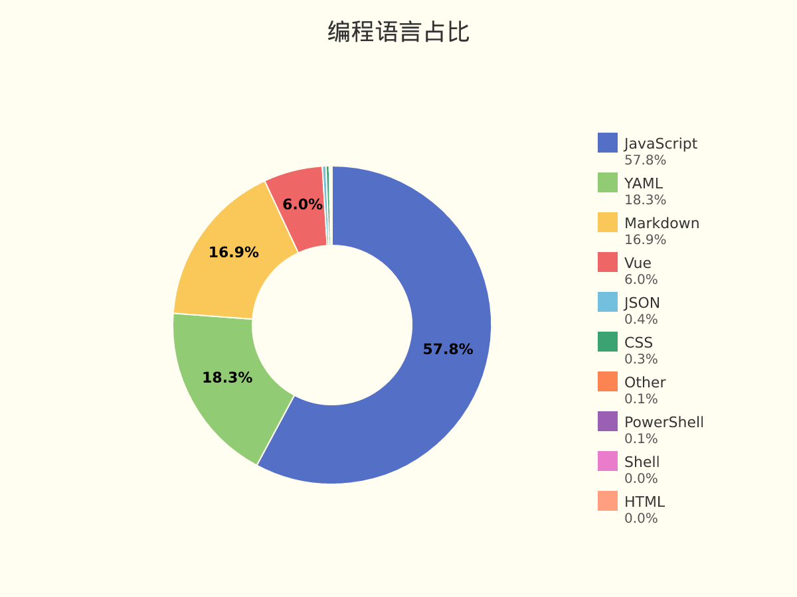
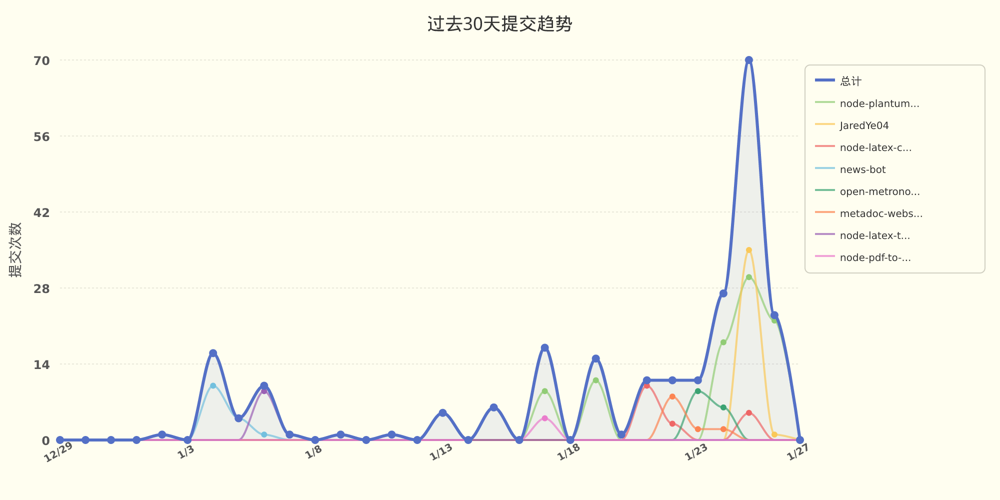

# JaredYe04 的个人主页

欢迎来到我的世界。
这里没有终点，只有不断逼近的答案。

我用代码书写思考，用重构回应混乱，
在技术与创造之间，寻找前进的方向。

这是 JaredYe's World ——
一个持续生长的空间，
也是我与未来对话的方式。

每一次运行，
都是对明天的调用。


###  📊 **过去七天我的编程活动统计**

```
💬 编程语言: 
JavaScript     	32 小时 57 分钟         	████████████████████████████░░░░░░░░░░░░░░░░░░░░░░	57.83 %
YAML           	10 小时 27 分钟         	█████████░░░░░░░░░░░░░░░░░░░░░░░░░░░░░░░░░░░░░░░░░	18.35 %
Markdown       	9 小时 36 分钟          	████████░░░░░░░░░░░░░░░░░░░░░░░░░░░░░░░░░░░░░░░░░░	16.87 %
Vue            	3 小时 24 分钟          	██░░░░░░░░░░░░░░░░░░░░░░░░░░░░░░░░░░░░░░░░░░░░░░░░	5.97 %
JSON           	12 分钟               	░░░░░░░░░░░░░░░░░░░░░░░░░░░░░░░░░░░░░░░░░░░░░░░░░░	0.37 %
CSS            	10 分钟               	░░░░░░░░░░░░░░░░░░░░░░░░░░░░░░░░░░░░░░░░░░░░░░░░░░	0.32 %
Other          	3 分钟                	░░░░░░░░░░░░░░░░░░░░░░░░░░░░░░░░░░░░░░░░░░░░░░░░░░	0.10 %
PowerShell     	1 分钟                	░░░░░░░░░░░░░░░░░░░░░░░░░░░░░░░░░░░░░░░░░░░░░░░░░░	0.06 %
Shell          	1 分钟                	░░░░░░░░░░░░░░░░░░░░░░░░░░░░░░░░░░░░░░░░░░░░░░░░░░	0.04 %
HTML           	1 分钟                	░░░░░░░░░░░░░░░░░░░░░░░░░░░░░░░░░░░░░░░░░░░░░░░░░░	0.04 %

⏱️ 使用电脑时间: 
总计 56 小时 58 分钟

📝 代码统计: 
总代码行数 (LOC)      11,165 行
提交次数               154 次
活跃仓库数             7 个
```

###  📊 **编程语言占比**

<picture>
  <source media="(prefers-color-scheme: dark)" srcset="images/language-pie-dark-24cd2618e7bd.png">
  
</picture>

###  📊 **主页浏览量**

  


  📈 **过去30天提交趋势**

<picture>
  <source media="(prefers-color-scheme: dark)" srcset="images/commit-trend-dark-c78ff37b1332.png">
  
</picture>


<picture>
  <source media="(prefers-color-scheme: dark)" srcset="https://raw.githubusercontent.com/JaredYe04/JaredYe04/main/output/github-contribution-grid-snake-dark.svg">
  
</picture>

