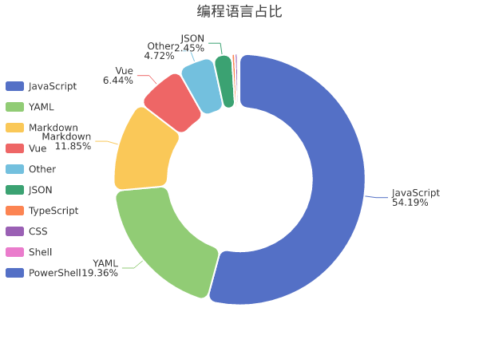

# JaredYe04 的个人主页

欢迎来到我的世界... 也许还需要更多时间来完善。

我的网站：JaredYe's World，探索我们前进的理由。

**我很高兴你能与我同行，寻找指引我们前进的光明。**

新的一天，也是新的奋斗召唤。

📊 **本周我的编程活动统计**

```
💬 编程语言: 
JavaScript     	27 小时 44 分钟         	███████████████████████████░░░░░░░░░░░░░░░░░░░░░░░	54.15 %
YAML           	9 小时 54 分钟          	█████████░░░░░░░░░░░░░░░░░░░░░░░░░░░░░░░░░░░░░░░░░	19.35 %
Markdown       	6 小时 3 分钟           	█████░░░░░░░░░░░░░░░░░░░░░░░░░░░░░░░░░░░░░░░░░░░░░	11.84 %
Vue            	3 小时 17 分钟          	███░░░░░░░░░░░░░░░░░░░░░░░░░░░░░░░░░░░░░░░░░░░░░░░	6.43 %
Other          	2 小时 25 分钟          	██░░░░░░░░░░░░░░░░░░░░░░░░░░░░░░░░░░░░░░░░░░░░░░░░	4.72 %
JSON           	1 小时 15 分钟          	█░░░░░░░░░░░░░░░░░░░░░░░░░░░░░░░░░░░░░░░░░░░░░░░░░	2.45 %
TypeScript     	12 分钟               	░░░░░░░░░░░░░░░░░░░░░░░░░░░░░░░░░░░░░░░░░░░░░░░░░░	0.39 %
CSS            	10 分钟               	░░░░░░░░░░░░░░░░░░░░░░░░░░░░░░░░░░░░░░░░░░░░░░░░░░	0.34 %
Shell          	5 分钟                	░░░░░░░░░░░░░░░░░░░░░░░░░░░░░░░░░░░░░░░░░░░░░░░░░░	0.18 %
PowerShell     	1 分钟                	░░░░░░░░░░░░░░░░░░░░░░░░░░░░░░░░░░░░░░░░░░░░░░░░░░	0.06 %

⏱️ 使用电脑时间: 
总计 51 小时 13 分钟

📝 代码统计: 
总代码行数 (LOC)      10,527 行
提交次数               118 次
活跃仓库数             7 个
```


📊 **编程语言占比**




📈 **过去30天提交趋势**

<details>
<summary>点击展开查看图表</summary>

<svg width="1000" height="500" xmlns="http://www.w3.org/2000/svg">
  <rect width="1000" height="500" fill="#ffffff"/>
  <text x="500" y="30" text-anchor="middle" font-size="18" font-weight="bold" fill="#333">过去30天提交趋势</text>
  <line x1="60" y1="60" x2="920" y2="60" stroke="#e0e0e0" stroke-width="1" stroke-dasharray="2,2"/>
  <text x="50" y="65" text-anchor="end" font-size="12" fill="#666">42</text>
  <line x1="60" y1="132" x2="920" y2="132" stroke="#e0e0e0" stroke-width="1" stroke-dasharray="2,2"/>
  <text x="50" y="137" text-anchor="end" font-size="12" fill="#666">34</text>
  <line x1="60" y1="204" x2="920" y2="204" stroke="#e0e0e0" stroke-width="1" stroke-dasharray="2,2"/>
  <text x="50" y="209" text-anchor="end" font-size="12" fill="#666">25</text>
  <line x1="60" y1="276" x2="920" y2="276" stroke="#e0e0e0" stroke-width="1" stroke-dasharray="2,2"/>
  <text x="50" y="281" text-anchor="end" font-size="12" fill="#666">17</text>
  <line x1="60" y1="348" x2="920" y2="348" stroke="#e0e0e0" stroke-width="1" stroke-dasharray="2,2"/>
  <text x="50" y="353" text-anchor="end" font-size="12" fill="#666">8</text>
  <line x1="60" y1="420" x2="920" y2="420" stroke="#e0e0e0" stroke-width="1" stroke-dasharray="2,2"/>
  <text x="50" y="425" text-anchor="end" font-size="12" fill="#666">0</text>
  <text x="20" y="250" text-anchor="middle" font-size="14" fill="#666" transform="rotate(-90, 20, 250)">提交次数</text>
  <path d="M 60,420 C 69.88505747126437,420 79.77011494252875,420 89.65517241379311,420 C 99.54022988505747,420 109.42528735632185,420 119.3103448275862,420 C 129.19540229885058,420 139.08045977011494,420 148.9655172413793,420 C 158.85057471264366,420 168.73563218390805,420 178.6206896551724,420 C 188.50574712643677,420 198.39080459770116,420 208.27586206896552,420 C 218.16091954022988,420 228.04597701149422,411.42857142857144 237.9310344827586,411.42857142857144 C 247.816091954023,411.42857142857144 257.7011494252874,420 267.58620689655174,420 C 277.4712643678161,420 287.35632183908046,282.8571428571429 297.2413793103448,282.8571428571429 C 307.1264367816092,282.8571428571429 317.0114942528736,385.7142857142857 326.89655172413796,385.7142857142857 C 336.7816091954023,385.7142857142857 346.6666666666667,334.2857142857143 356.55172413793105,334.2857142857143 C 366.4367816091954,334.2857142857143 376.32183908045977,411.42857142857144 386.2068965517241,411.42857142857144 C 396.0919540229885,411.42857142857144 405.97701149425285,420 415.8620689655172,420 C 425.74712643678157,420 435.632183908046,411.42857142857144 445.51724137931035,411.42857142857144 C 455.4022988505747,411.42857142857144 465.2873563218391,420 475.1724137931035,420 C 485.05747126436785,420 494.9425287356322,411.42857142857144 504.82758620689657,411.42857142857144 C 514.7126436781609,411.42857142857144 524.5977011494252,420 534.4827586206897,420 C 544.3678160919541,420 554.2528735632184,377.14285714285717 564.1379310344828,377.14285714285717 C 574.0229885057472,377.14285714285717 583.9080459770116,420 593.7931034482759,420 C 603.6781609195402,420 613.5632183908045,368.57142857142856 623.448275862069,368.57142857142856 C 633.3333333333334,368.57142857142856 643.2183908045977,420 653.1034482758621,420 C 662.9885057471265,420 672.8735632183909,274.2857142857143 682.7586206896552,274.2857142857143 C 692.6436781609195,274.2857142857143 702.5287356321838,420 712.4137931034483,420 C 722.2988505747127,420 732.1839080459771,291.42857142857144 742.0689655172414,291.42857142857144 C 751.9540229885057,291.42857142857144 761.83908045977,411.42857142857144 771.7241379310344,411.42857142857144 C 781.6091954022988,411.42857142857144 791.4942528735631,325.7142857142857 801.3793103448276,325.7142857142857 C 811.264367816092,325.7142857142857 821.1494252873564,325.7142857142857 831.0344827586207,325.7142857142857 C 840.919540229885,325.7142857142857 850.8045977011493,325.7142857142857 860.6896551724137,325.7142857142857 C 870.5747126436781,325.7142857142857 880.4597701149427,188.57142857142856 890.344827586207,188.57142857142856 C 900.2298850574713,188.57142857142856 920,60 920,60 L 920,420 L 60,420 Z" fill="rgba(84, 112, 198, 0.1)" stroke="none"/>
  <path d="M 60,420 C 69.88505747126437,420 79.77011494252875,420 89.65517241379311,420 C 99.54022988505747,420 109.42528735632185,420 119.3103448275862,420 C 129.19540229885058,420 139.08045977011494,420 148.9655172413793,420 C 158.85057471264366,420 168.73563218390805,420 178.6206896551724,420 C 188.50574712643677,420 198.39080459770116,420 208.27586206896552,420 C 218.16091954022988,420 228.04597701149422,420 237.9310344827586,420 C 247.816091954023,420 257.7011494252874,420 267.58620689655174,420 C 277.4712643678161,420 287.35632183908046,420 297.2413793103448,420 C 307.1264367816092,420 317.0114942528736,420 326.89655172413796,420 C 336.7816091954023,420 346.6666666666667,420 356.55172413793105,420 C 366.4367816091954,420 376.32183908045977,420 386.2068965517241,420 C 396.0919540229885,420 405.97701149425285,420 415.8620689655172,420 C 425.74712643678157,420 435.632183908046,420 445.51724137931035,420 C 455.4022988505747,420 465.2873563218391,420 475.1724137931035,420 C 485.05747126436785,420 494.9425287356322,420 504.82758620689657,420 C 514.7126436781609,420 524.5977011494252,420 534.4827586206897,420 C 544.3678160919541,420 554.2528735632184,420 564.1379310344828,420 C 574.0229885057472,420 583.9080459770116,420 593.7931034482759,420 C 603.6781609195402,420 613.5632183908045,420 623.448275862069,420 C 633.3333333333334,420 643.2183908045977,420 653.1034482758621,420 C 662.9885057471265,420 672.8735632183909,342.8571428571429 682.7586206896552,342.8571428571429 C 692.6436781609195,342.8571428571429 702.5287356321838,420 712.4137931034483,420 C 722.2988505747127,420 732.1839080459771,325.7142857142857 742.0689655172414,325.7142857142857 C 751.9540229885057,325.7142857142857 761.83908045977,420 771.7241379310344,420 C 781.6091954022988,420 791.4942528735631,420 801.3793103448276,420 C 811.264367816092,420 821.1494252873564,420 831.0344827586207,420 C 840.919540229885,420 850.8045977011493,420 860.6896551724137,420 C 870.5747126436781,420 880.4597701149427,265.7142857142857 890.344827586207,265.7142857142857 C 900.2298850574713,265.7142857142857 920,162.85714285714283 920,162.85714285714283" fill="none" stroke="#91cc75" stroke-width="2" opacity="0.7"/>
  <circle cx="682.7586206896552" cy="342.8571428571429" r="3" fill="#91cc75"/>
  <circle cx="742.0689655172414" cy="325.7142857142857" r="3" fill="#91cc75"/>
  <circle cx="890.344827586207" cy="265.7142857142857" r="3" fill="#91cc75"/>
  <circle cx="920" cy="162.85714285714283" r="3" fill="#91cc75"/>
  <path d="M 60,420 C 69.88505747126437,420 79.77011494252875,420 89.65517241379311,420 C 99.54022988505747,420 109.42528735632185,420 119.3103448275862,420 C 129.19540229885058,420 139.08045977011494,420 148.9655172413793,420 C 158.85057471264366,420 168.73563218390805,420 178.6206896551724,420 C 188.50574712643677,420 198.39080459770116,420 208.27586206896552,420 C 218.16091954022988,420 228.04597701149422,420 237.9310344827586,420 C 247.816091954023,420 257.7011494252874,420 267.58620689655174,420 C 277.4712643678161,420 287.35632183908046,420 297.2413793103448,420 C 307.1264367816092,420 317.0114942528736,420 326.89655172413796,420 C 336.7816091954023,420 346.6666666666667,420 356.55172413793105,420 C 366.4367816091954,420 376.32183908045977,420 386.2068965517241,420 C 396.0919540229885,420 405.97701149425285,420 415.8620689655172,420 C 425.74712643678157,420 435.632183908046,420 445.51724137931035,420 C 455.4022988505747,420 465.2873563218391,420 475.1724137931035,420 C 485.05747126436785,420 494.9425287356322,420 504.82758620689657,420 C 514.7126436781609,420 524.5977011494252,420 534.4827586206897,420 C 544.3678160919541,420 554.2528735632184,420 564.1379310344828,420 C 574.0229885057472,420 583.9080459770116,420 593.7931034482759,420 C 603.6781609195402,420 613.5632183908045,420 623.448275862069,420 C 633.3333333333334,420 643.2183908045977,420 653.1034482758621,420 C 662.9885057471265,420 672.8735632183909,420 682.7586206896552,420 C 692.6436781609195,420 702.5287356321838,420 712.4137931034483,420 C 722.2988505747127,420 732.1839080459771,420 742.0689655172414,420 C 751.9540229885057,420 761.83908045977,420 771.7241379310344,420 C 781.6091954022988,420 791.4942528735631,334.2857142857143 801.3793103448276,334.2857142857143 C 811.264367816092,334.2857142857143 821.1494252873564,394.2857142857143 831.0344827586207,394.2857142857143 C 840.919540229885,394.2857142857143 850.8045977011493,420 860.6896551724137,420 C 870.5747126436781,420 880.4597701149427,420 890.344827586207,420 C 900.2298850574713,420 920,377.14285714285717 920,377.14285714285717" fill="none" stroke="#fac858" stroke-width="2" opacity="0.7"/>
  <circle cx="801.3793103448276" cy="334.2857142857143" r="3" fill="#fac858"/>
  <circle cx="831.0344827586207" cy="394.2857142857143" r="3" fill="#fac858"/>
  <circle cx="920" cy="377.14285714285717" r="3" fill="#fac858"/>
  <path d="M 60,420 C 69.88505747126437,420 79.77011494252875,420 89.65517241379311,420 C 99.54022988505747,420 109.42528735632185,420 119.3103448275862,420 C 129.19540229885058,420 139.08045977011494,420 148.9655172413793,420 C 158.85057471264366,420 168.73563218390805,420 178.6206896551724,420 C 188.50574712643677,420 198.39080459770116,420 208.27586206896552,420 C 218.16091954022988,420 228.04597701149422,420 237.9310344827586,420 C 247.816091954023,420 257.7011494252874,420 267.58620689655174,420 C 277.4712643678161,420 287.35632183908046,334.2857142857143 297.2413793103448,334.2857142857143 C 307.1264367816092,334.2857142857143 317.0114942528736,385.7142857142857 326.89655172413796,385.7142857142857 C 336.7816091954023,385.7142857142857 346.6666666666667,411.42857142857144 356.55172413793105,411.42857142857144 C 366.4367816091954,411.42857142857144 376.32183908045977,420 386.2068965517241,420 C 396.0919540229885,420 405.97701149425285,420 415.8620689655172,420 C 425.74712643678157,420 435.632183908046,420 445.51724137931035,420 C 455.4022988505747,420 465.2873563218391,420 475.1724137931035,420 C 485.05747126436785,420 494.9425287356322,411.42857142857144 504.82758620689657,411.42857142857144 C 514.7126436781609,411.42857142857144 524.5977011494252,420 534.4827586206897,420 C 544.3678160919541,420 554.2528735632184,420 564.1379310344828,420 C 574.0229885057472,420 583.9080459770116,420 593.7931034482759,420 C 603.6781609195402,420 613.5632183908045,420 623.448275862069,420 C 633.3333333333334,420 643.2183908045977,420 653.1034482758621,420 C 662.9885057471265,420 672.8735632183909,420 682.7586206896552,420 C 692.6436781609195,420 702.5287356321838,420 712.4137931034483,420 C 722.2988505747127,420 732.1839080459771,420 742.0689655172414,420 C 751.9540229885057,420 761.83908045977,420 771.7241379310344,420 C 781.6091954022988,420 791.4942528735631,420 801.3793103448276,420 C 811.264367816092,420 821.1494252873564,420 831.0344827586207,420 C 840.919540229885,420 850.8045977011493,420 860.6896551724137,420 C 870.5747126436781,420 880.4597701149427,420 890.344827586207,420 C 900.2298850574713,420 920,420 920,420" fill="none" stroke="#ee6666" stroke-width="2" opacity="0.7"/>
  <circle cx="297.2413793103448" cy="334.2857142857143" r="3" fill="#ee6666"/>
  <circle cx="326.89655172413796" cy="385.7142857142857" r="3" fill="#ee6666"/>
  <circle cx="356.55172413793105" cy="411.42857142857144" r="3" fill="#ee6666"/>
  <circle cx="504.82758620689657" cy="411.42857142857144" r="3" fill="#ee6666"/>
  <path d="M 60,420 C 69.88505747126437,420 79.77011494252875,420 89.65517241379311,420 C 99.54022988505747,420 109.42528735632185,420 119.3103448275862,420 C 129.19540229885058,420 139.08045977011494,420 148.9655172413793,420 C 158.85057471264366,420 168.73563218390805,420 178.6206896551724,420 C 188.50574712643677,420 198.39080459770116,420 208.27586206896552,420 C 218.16091954022988,420 228.04597701149422,420 237.9310344827586,420 C 247.816091954023,420 257.7011494252874,420 267.58620689655174,420 C 277.4712643678161,420 287.35632183908046,420 297.2413793103448,420 C 307.1264367816092,420 317.0114942528736,420 326.89655172413796,420 C 336.7816091954023,420 346.6666666666667,420 356.55172413793105,420 C 366.4367816091954,420 376.32183908045977,420 386.2068965517241,420 C 396.0919540229885,420 405.97701149425285,420 415.8620689655172,420 C 425.74712643678157,420 435.632183908046,420 445.51724137931035,420 C 455.4022988505747,420 465.2873563218391,420 475.1724137931035,420 C 485.05747126436785,420 494.9425287356322,420 504.82758620689657,420 C 514.7126436781609,420 524.5977011494252,420 534.4827586206897,420 C 544.3678160919541,420 554.2528735632184,420 564.1379310344828,420 C 574.0229885057472,420 583.9080459770116,420 593.7931034482759,420 C 603.6781609195402,420 613.5632183908045,420 623.448275862069,420 C 633.3333333333334,420 643.2183908045977,420 653.1034482758621,420 C 662.9885057471265,420 672.8735632183909,420 682.7586206896552,420 C 692.6436781609195,420 702.5287356321838,420 712.4137931034483,420 C 722.2988505747127,420 732.1839080459771,420 742.0689655172414,420 C 751.9540229885057,420 761.83908045977,420 771.7241379310344,420 C 781.6091954022988,420 791.4942528735631,420 801.3793103448276,420 C 811.264367816092,420 821.1494252873564,420 831.0344827586207,420 C 840.919540229885,420 850.8045977011493,342.8571428571429 860.6896551724137,342.8571428571429 C 870.5747126436781,342.8571428571429 880.4597701149427,368.57142857142856 890.344827586207,368.57142857142856 C 900.2298850574713,368.57142857142856 920,420 920,420" fill="none" stroke="#73c0de" stroke-width="2" opacity="0.7"/>
  <circle cx="860.6896551724137" cy="342.8571428571429" r="3" fill="#73c0de"/>
  <circle cx="890.344827586207" cy="368.57142857142856" r="3" fill="#73c0de"/>
  <path d="M 60,420 C 69.88505747126437,420 79.77011494252875,420 89.65517241379311,420 C 99.54022988505747,420 109.42528735632185,420 119.3103448275862,420 C 129.19540229885058,420 139.08045977011494,420 148.9655172413793,420 C 158.85057471264366,420 168.73563218390805,420 178.6206896551724,420 C 188.50574712643677,420 198.39080459770116,420 208.27586206896552,420 C 218.16091954022988,420 228.04597701149422,420 237.9310344827586,420 C 247.816091954023,420 257.7011494252874,420 267.58620689655174,420 C 277.4712643678161,420 287.35632183908046,420 297.2413793103448,420 C 307.1264367816092,420 317.0114942528736,420 326.89655172413796,420 C 336.7816091954023,420 346.6666666666667,420 356.55172413793105,420 C 366.4367816091954,420 376.32183908045977,420 386.2068965517241,420 C 396.0919540229885,420 405.97701149425285,420 415.8620689655172,420 C 425.74712643678157,420 435.632183908046,420 445.51724137931035,420 C 455.4022988505747,420 465.2873563218391,420 475.1724137931035,420 C 485.05747126436785,420 494.9425287356322,420 504.82758620689657,420 C 514.7126436781609,420 524.5977011494252,420 534.4827586206897,420 C 544.3678160919541,420 554.2528735632184,420 564.1379310344828,420 C 574.0229885057472,420 583.9080459770116,420 593.7931034482759,420 C 603.6781609195402,420 613.5632183908045,420 623.448275862069,420 C 633.3333333333334,420 643.2183908045977,420 653.1034482758621,420 C 662.9885057471265,420 672.8735632183909,420 682.7586206896552,420 C 692.6436781609195,420 702.5287356321838,420 712.4137931034483,420 C 722.2988505747127,420 732.1839080459771,420 742.0689655172414,420 C 751.9540229885057,420 761.83908045977,420 771.7241379310344,420 C 781.6091954022988,420 791.4942528735631,420 801.3793103448276,420 C 811.264367816092,420 821.1494252873564,351.42857142857144 831.0344827586207,351.42857142857144 C 840.919540229885,351.42857142857144 850.8045977011493,402.85714285714283 860.6896551724137,402.85714285714283 C 870.5747126436781,402.85714285714283 880.4597701149427,402.85714285714283 890.344827586207,402.85714285714283 C 900.2298850574713,402.85714285714283 920,420 920,420" fill="none" stroke="#3ba272" stroke-width="2" opacity="0.7"/>
  <circle cx="831.0344827586207" cy="351.42857142857144" r="3" fill="#3ba272"/>
  <circle cx="860.6896551724137" cy="402.85714285714283" r="3" fill="#3ba272"/>
  <circle cx="890.344827586207" cy="402.85714285714283" r="3" fill="#3ba272"/>
  <path d="M 60,420 C 69.88505747126437,420 79.77011494252875,420 89.65517241379311,420 C 99.54022988505747,420 109.42528735632185,420 119.3103448275862,420 C 129.19540229885058,420 139.08045977011494,420 148.9655172413793,420 C 158.85057471264366,420 168.73563218390805,420 178.6206896551724,420 C 188.50574712643677,420 198.39080459770116,420 208.27586206896552,420 C 218.16091954022988,420 228.04597701149422,420 237.9310344827586,420 C 247.816091954023,420 257.7011494252874,420 267.58620689655174,420 C 277.4712643678161,420 287.35632183908046,420 297.2413793103448,420 C 307.1264367816092,420 317.0114942528736,420 326.89655172413796,420 C 336.7816091954023,420 346.6666666666667,342.8571428571429 356.55172413793105,342.8571428571429 C 366.4367816091954,342.8571428571429 376.32183908045977,411.42857142857144 386.2068965517241,411.42857142857144 C 396.0919540229885,411.42857142857144 405.97701149425285,420 415.8620689655172,420 C 425.74712643678157,420 435.632183908046,420 445.51724137931035,420 C 455.4022988505747,420 465.2873563218391,420 475.1724137931035,420 C 485.05747126436785,420 494.9425287356322,420 504.82758620689657,420 C 514.7126436781609,420 524.5977011494252,420 534.4827586206897,420 C 544.3678160919541,420 554.2528735632184,420 564.1379310344828,420 C 574.0229885057472,420 583.9080459770116,420 593.7931034482759,420 C 603.6781609195402,420 613.5632183908045,420 623.448275862069,420 C 633.3333333333334,420 643.2183908045977,420 653.1034482758621,420 C 662.9885057471265,420 672.8735632183909,420 682.7586206896552,420 C 692.6436781609195,420 702.5287356321838,420 712.4137931034483,420 C 722.2988505747127,420 732.1839080459771,420 742.0689655172414,420 C 751.9540229885057,420 761.83908045977,420 771.7241379310344,420 C 781.6091954022988,420 791.4942528735631,420 801.3793103448276,420 C 811.264367816092,420 821.1494252873564,420 831.0344827586207,420 C 840.919540229885,420 850.8045977011493,420 860.6896551724137,420 C 870.5747126436781,420 880.4597701149427,420 890.344827586207,420 C 900.2298850574713,420 920,420 920,420" fill="none" stroke="#fc8452" stroke-width="2" opacity="0.7"/>
  <circle cx="356.55172413793105" cy="342.8571428571429" r="3" fill="#fc8452"/>
  <circle cx="386.2068965517241" cy="411.42857142857144" r="3" fill="#fc8452"/>
  <path d="M 60,420 C 69.88505747126437,420 79.77011494252875,420 89.65517241379311,420 C 99.54022988505747,420 109.42528735632185,420 119.3103448275862,420 C 129.19540229885058,420 139.08045977011494,420 148.9655172413793,420 C 158.85057471264366,420 168.73563218390805,420 178.6206896551724,420 C 188.50574712643677,420 198.39080459770116,420 208.27586206896552,420 C 218.16091954022988,420 228.04597701149422,420 237.9310344827586,420 C 247.816091954023,420 257.7011494252874,420 267.58620689655174,420 C 277.4712643678161,420 287.35632183908046,420 297.2413793103448,420 C 307.1264367816092,420 317.0114942528736,420 326.89655172413796,420 C 336.7816091954023,420 346.6666666666667,420 356.55172413793105,420 C 366.4367816091954,420 376.32183908045977,420 386.2068965517241,420 C 396.0919540229885,420 405.97701149425285,420 415.8620689655172,420 C 425.74712643678157,420 435.632183908046,420 445.51724137931035,420 C 455.4022988505747,420 465.2873563218391,420 475.1724137931035,420 C 485.05747126436785,420 494.9425287356322,420 504.82758620689657,420 C 514.7126436781609,420 524.5977011494252,420 534.4827586206897,420 C 544.3678160919541,420 554.2528735632184,420 564.1379310344828,420 C 574.0229885057472,420 583.9080459770116,420 593.7931034482759,420 C 603.6781609195402,420 613.5632183908045,368.57142857142856 623.448275862069,368.57142857142856 C 633.3333333333334,368.57142857142856 643.2183908045977,420 653.1034482758621,420 C 662.9885057471265,420 672.8735632183909,385.7142857142857 682.7586206896552,385.7142857142857 C 692.6436781609195,385.7142857142857 702.5287356321838,420 712.4137931034483,420 C 722.2988505747127,420 732.1839080459771,420 742.0689655172414,420 C 751.9540229885057,420 761.83908045977,420 771.7241379310344,420 C 781.6091954022988,420 791.4942528735631,420 801.3793103448276,420 C 811.264367816092,420 821.1494252873564,420 831.0344827586207,420 C 840.919540229885,420 850.8045977011493,420 860.6896551724137,420 C 870.5747126436781,420 880.4597701149427,420 890.344827586207,420 C 900.2298850574713,420 920,420 920,420" fill="none" stroke="#9a60b4" stroke-width="2" opacity="0.7"/>
  <circle cx="623.448275862069" cy="368.57142857142856" r="3" fill="#9a60b4"/>
  <circle cx="682.7586206896552" cy="385.7142857142857" r="3" fill="#9a60b4"/>
  <path d="M 60,420 C 69.88505747126437,420 79.77011494252875,420 89.65517241379311,420 C 99.54022988505747,420 109.42528735632185,420 119.3103448275862,420 C 129.19540229885058,420 139.08045977011494,420 148.9655172413793,420 C 158.85057471264366,420 168.73563218390805,420 178.6206896551724,420 C 188.50574712643677,420 198.39080459770116,420 208.27586206896552,420 C 218.16091954022988,420 228.04597701149422,420 237.9310344827586,420 C 247.816091954023,420 257.7011494252874,420 267.58620689655174,420 C 277.4712643678161,420 287.35632183908046,420 297.2413793103448,420 C 307.1264367816092,420 317.0114942528736,420 326.89655172413796,420 C 336.7816091954023,420 346.6666666666667,420 356.55172413793105,420 C 366.4367816091954,420 376.32183908045977,420 386.2068965517241,420 C 396.0919540229885,420 405.97701149425285,420 415.8620689655172,420 C 425.74712643678157,420 435.632183908046,420 445.51724137931035,420 C 455.4022988505747,420 465.2873563218391,420 475.1724137931035,420 C 485.05747126436785,420 494.9425287356322,420 504.82758620689657,420 C 514.7126436781609,420 524.5977011494252,420 534.4827586206897,420 C 544.3678160919541,420 554.2528735632184,420 564.1379310344828,420 C 574.0229885057472,420 583.9080459770116,420 593.7931034482759,420 C 603.6781609195402,420 613.5632183908045,420 623.448275862069,420 C 633.3333333333334,420 643.2183908045977,420 653.1034482758621,420 C 662.9885057471265,420 672.8735632183909,385.7142857142857 682.7586206896552,385.7142857142857 C 692.6436781609195,385.7142857142857 702.5287356321838,420 712.4137931034483,420 C 722.2988505747127,420 732.1839080459771,385.7142857142857 742.0689655172414,385.7142857142857 C 751.9540229885057,385.7142857142857 761.83908045977,411.42857142857144 771.7241379310344,411.42857142857144 C 781.6091954022988,411.42857142857144 791.4942528735631,411.42857142857144 801.3793103448276,411.42857142857144 C 811.264367816092,411.42857142857144 821.1494252873564,420 831.0344827586207,420 C 840.919540229885,420 850.8045977011493,420 860.6896551724137,420 C 870.5747126436781,420 880.4597701149427,420 890.344827586207,420 C 900.2298850574713,420 920,420 920,420" fill="none" stroke="#ea7ccc" stroke-width="2" opacity="0.7"/>
  <circle cx="682.7586206896552" cy="385.7142857142857" r="3" fill="#ea7ccc"/>
  <circle cx="742.0689655172414" cy="385.7142857142857" r="3" fill="#ea7ccc"/>
  <circle cx="771.7241379310344" cy="411.42857142857144" r="3" fill="#ea7ccc"/>
  <circle cx="801.3793103448276" cy="411.42857142857144" r="3" fill="#ea7ccc"/>
  <path d="M 60,420 C 69.88505747126437,420 79.77011494252875,420 89.65517241379311,420 C 99.54022988505747,420 109.42528735632185,420 119.3103448275862,420 C 129.19540229885058,420 139.08045977011494,420 148.9655172413793,420 C 158.85057471264366,420 168.73563218390805,420 178.6206896551724,420 C 188.50574712643677,420 198.39080459770116,420 208.27586206896552,420 C 218.16091954022988,420 228.04597701149422,411.42857142857144 237.9310344827586,411.42857142857144 C 247.816091954023,411.42857142857144 257.7011494252874,420 267.58620689655174,420 C 277.4712643678161,420 287.35632183908046,282.8571428571429 297.2413793103448,282.8571428571429 C 307.1264367816092,282.8571428571429 317.0114942528736,385.7142857142857 326.89655172413796,385.7142857142857 C 336.7816091954023,385.7142857142857 346.6666666666667,334.2857142857143 356.55172413793105,334.2857142857143 C 366.4367816091954,334.2857142857143 376.32183908045977,411.42857142857144 386.2068965517241,411.42857142857144 C 396.0919540229885,411.42857142857144 405.97701149425285,420 415.8620689655172,420 C 425.74712643678157,420 435.632183908046,411.42857142857144 445.51724137931035,411.42857142857144 C 455.4022988505747,411.42857142857144 465.2873563218391,420 475.1724137931035,420 C 485.05747126436785,420 494.9425287356322,411.42857142857144 504.82758620689657,411.42857142857144 C 514.7126436781609,411.42857142857144 524.5977011494252,420 534.4827586206897,420 C 544.3678160919541,420 554.2528735632184,377.14285714285717 564.1379310344828,377.14285714285717 C 574.0229885057472,377.14285714285717 583.9080459770116,420 593.7931034482759,420 C 603.6781609195402,420 613.5632183908045,368.57142857142856 623.448275862069,368.57142857142856 C 633.3333333333334,368.57142857142856 643.2183908045977,420 653.1034482758621,420 C 662.9885057471265,420 672.8735632183909,274.2857142857143 682.7586206896552,274.2857142857143 C 692.6436781609195,274.2857142857143 702.5287356321838,420 712.4137931034483,420 C 722.2988505747127,420 732.1839080459771,291.42857142857144 742.0689655172414,291.42857142857144 C 751.9540229885057,291.42857142857144 761.83908045977,411.42857142857144 771.7241379310344,411.42857142857144 C 781.6091954022988,411.42857142857144 791.4942528735631,325.7142857142857 801.3793103448276,325.7142857142857 C 811.264367816092,325.7142857142857 821.1494252873564,325.7142857142857 831.0344827586207,325.7142857142857 C 840.919540229885,325.7142857142857 850.8045977011493,325.7142857142857 860.6896551724137,325.7142857142857 C 870.5747126436781,325.7142857142857 880.4597701149427,188.57142857142856 890.344827586207,188.57142857142856 C 900.2298850574713,188.57142857142856 920,60 920,60" fill="none" stroke="#5470c6" stroke-width="3"/>
  <circle cx="60" cy="420" r="4" fill="#5470c6"/>
  <circle cx="89.65517241379311" cy="420" r="4" fill="#5470c6"/>
  <circle cx="119.3103448275862" cy="420" r="4" fill="#5470c6"/>
  <circle cx="148.9655172413793" cy="420" r="4" fill="#5470c6"/>
  <circle cx="178.6206896551724" cy="420" r="4" fill="#5470c6"/>
  <circle cx="208.27586206896552" cy="420" r="4" fill="#5470c6"/>
  <circle cx="237.9310344827586" cy="411.42857142857144" r="4" fill="#5470c6"/>
  <circle cx="267.58620689655174" cy="420" r="4" fill="#5470c6"/>
  <circle cx="297.2413793103448" cy="282.8571428571429" r="4" fill="#5470c6"/>
  <circle cx="326.89655172413796" cy="385.7142857142857" r="4" fill="#5470c6"/>
  <circle cx="356.55172413793105" cy="334.2857142857143" r="4" fill="#5470c6"/>
  <circle cx="386.2068965517241" cy="411.42857142857144" r="4" fill="#5470c6"/>
  <circle cx="415.8620689655172" cy="420" r="4" fill="#5470c6"/>
  <circle cx="445.51724137931035" cy="411.42857142857144" r="4" fill="#5470c6"/>
  <circle cx="475.1724137931035" cy="420" r="4" fill="#5470c6"/>
  <circle cx="504.82758620689657" cy="411.42857142857144" r="4" fill="#5470c6"/>
  <circle cx="534.4827586206897" cy="420" r="4" fill="#5470c6"/>
  <circle cx="564.1379310344828" cy="377.14285714285717" r="4" fill="#5470c6"/>
  <circle cx="593.7931034482759" cy="420" r="4" fill="#5470c6"/>
  <circle cx="623.448275862069" cy="368.57142857142856" r="4" fill="#5470c6"/>
  <circle cx="653.1034482758621" cy="420" r="4" fill="#5470c6"/>
  <circle cx="682.7586206896552" cy="274.2857142857143" r="4" fill="#5470c6"/>
  <circle cx="712.4137931034483" cy="420" r="4" fill="#5470c6"/>
  <circle cx="742.0689655172414" cy="291.42857142857144" r="4" fill="#5470c6"/>
  <circle cx="771.7241379310344" cy="411.42857142857144" r="4" fill="#5470c6"/>
  <circle cx="801.3793103448276" cy="325.7142857142857" r="4" fill="#5470c6"/>
  <circle cx="831.0344827586207" cy="325.7142857142857" r="4" fill="#5470c6"/>
  <circle cx="860.6896551724137" cy="325.7142857142857" r="4" fill="#5470c6"/>
  <circle cx="890.344827586207" cy="188.57142857142856" r="4" fill="#5470c6"/>
  <circle cx="920" cy="60" r="4" fill="#5470c6"/>
  <text x="60" y="440" text-anchor="middle" font-size="11" fill="#666" transform="rotate(-45, 60, 440)">12/27</text>
  <text x="208.27586206896552" y="440" text-anchor="middle" font-size="11" fill="#666" transform="rotate(-45, 208.27586206896552, 440)">1/1</text>
  <text x="356.55172413793105" y="440" text-anchor="middle" font-size="11" fill="#666" transform="rotate(-45, 356.55172413793105, 440)">1/6</text>
  <text x="504.82758620689657" y="440" text-anchor="middle" font-size="11" fill="#666" transform="rotate(-45, 504.82758620689657, 440)">1/11</text>
  <text x="653.1034482758621" y="440" text-anchor="middle" font-size="11" fill="#666" transform="rotate(-45, 653.1034482758621, 440)">1/16</text>
  <text x="801.3793103448276" y="440" text-anchor="middle" font-size="11" fill="#666" transform="rotate(-45, 801.3793103448276, 440)">1/21</text>
  <text x="920" y="440" text-anchor="middle" font-size="11" fill="#666" transform="rotate(-45, 920, 440)">1/25</text>
  <rect x="930" y="65" width="150" height="235" fill="white" stroke="#e0e0e0" stroke-width="1" rx="5"/>
  <line x1="940" y1="80" x2="960" y2="80" stroke="#5470c6" stroke-width="3"/>
  <text x="965" y="85" font-size="12" fill="#333">总计</text>
  <line x1="940" y1="105" x2="960" y2="105" stroke="#91cc75" stroke-width="2" opacity="0.7"/>
  <text x="965" y="110" font-size="11" fill="#333">node-plantuml-2</text>
  <line x1="940" y1="130" x2="960" y2="130" stroke="#fac858" stroke-width="2" opacity="0.7"/>
  <text x="965" y="135" font-size="11" fill="#333">node-latex-comp...</text>
  <line x1="940" y1="155" x2="960" y2="155" stroke="#ee6666" stroke-width="2" opacity="0.7"/>
  <text x="965" y="160" font-size="11" fill="#333">news-bot</text>
  <line x1="940" y1="180" x2="960" y2="180" stroke="#73c0de" stroke-width="2" opacity="0.7"/>
  <text x="965" y="185" font-size="11" fill="#333">open-metronome</text>
  <line x1="940" y1="205" x2="960" y2="205" stroke="#3ba272" stroke-width="2" opacity="0.7"/>
  <text x="965" y="210" font-size="11" fill="#333">metadoc-website</text>
  <line x1="940" y1="230" x2="960" y2="230" stroke="#fc8452" stroke-width="2" opacity="0.7"/>
  <text x="965" y="235" font-size="11" fill="#333">node-latex-to-o...</text>
  <line x1="940" y1="255" x2="960" y2="255" stroke="#9a60b4" stroke-width="2" opacity="0.7"/>
  <text x="965" y="260" font-size="11" fill="#333">node-pdf-to-mar...</text>
  <line x1="940" y1="280" x2="960" y2="280" stroke="#ea7ccc" stroke-width="2" opacity="0.7"/>
  <text x="965" y="285" font-size="11" fill="#333">npm-crawler</text>
</svg>

</details>


> ⏱️ 活动数据基于 GitHub 事件推断（无需 IDE 插件）


## 关于

这是我的 GitHub 个人主页配置文件。

github.com/JaredYe04 

