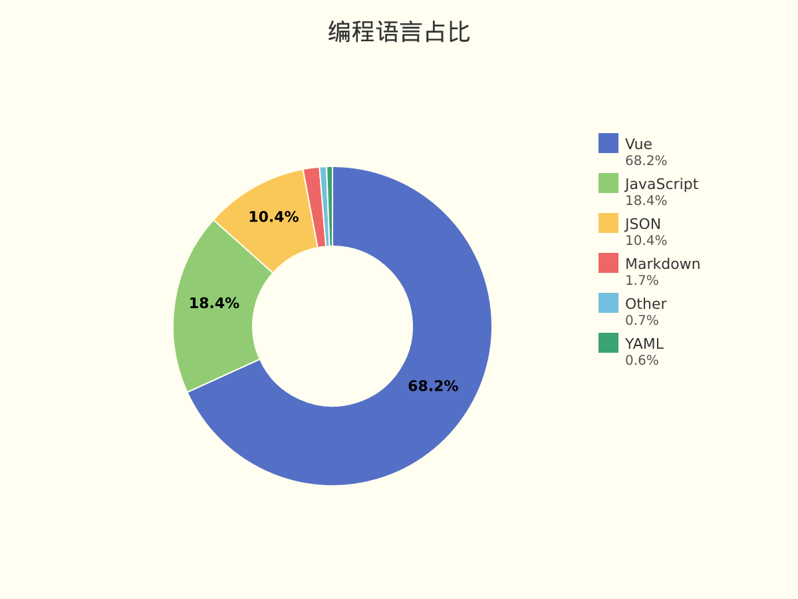
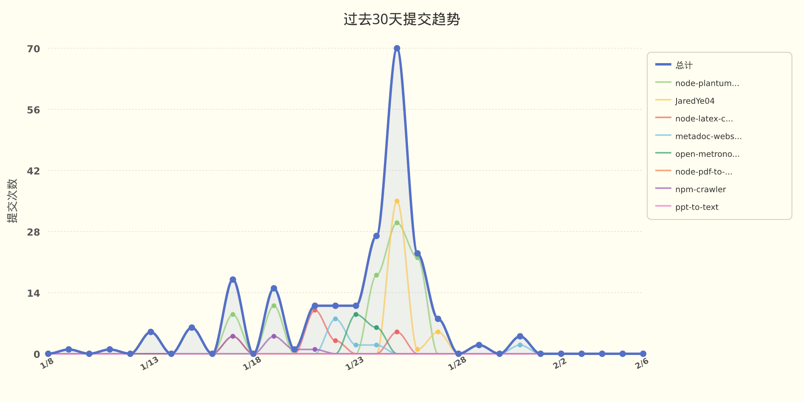

# JaredYe04 的个人主页

欢迎来到我的世界。
这里没有终点，只有不断逼近的答案。

我用代码书写思考，用重构回应混乱，
在技术与创造之间，寻找前进的方向。

这是 JaredYe's World ——
一个持续生长的空间，
也是我与未来对话的方式。

每一次运行，
都是对明天的调用。


###  📊 **过去七天我的编程活动统计**

```
💬 编程语言: 
Vue            	1 小时 52 分钟          	██████████████████████████████████░░░░░░░░░░░░░░░░	68.21 %
JavaScript     	30 分钟               	█████████░░░░░░░░░░░░░░░░░░░░░░░░░░░░░░░░░░░░░░░░░	18.39 %
JSON           	17 分钟               	█████░░░░░░░░░░░░░░░░░░░░░░░░░░░░░░░░░░░░░░░░░░░░░	10.44 %
Markdown       	2 分钟                	░░░░░░░░░░░░░░░░░░░░░░░░░░░░░░░░░░░░░░░░░░░░░░░░░░	1.66 %
Other          	1 分钟                	░░░░░░░░░░░░░░░░░░░░░░░░░░░░░░░░░░░░░░░░░░░░░░░░░░	0.71 %
YAML           	0 分钟                	░░░░░░░░░░░░░░░░░░░░░░░░░░░░░░░░░░░░░░░░░░░░░░░░░░	0.59 %

⏱️ 使用电脑时间: 
总计 2 小时 44 分钟

📝 代码统计: 
总代码行数 (LOC)      843 行
提交次数               4 次
活跃仓库数             2 个
```

###  📊 **编程语言占比**

<picture>
  <source media="(prefers-color-scheme: dark)" srcset="images/language-pie-dark-009977c75fed.png">
  
</picture>

###  📊 **主页浏览量**

  


  📈 **过去30天提交趋势**

<picture>
  <source media="(prefers-color-scheme: dark)" srcset="images/commit-trend-dark-a9833955a383.png">
  
</picture>


<picture>
  <source media="(prefers-color-scheme: dark)" srcset="https://raw.githubusercontent.com/JaredYe04/JaredYe04/main/output/github-contribution-grid-snake-dark.svg">
  
</picture>

---

**最后更新**: 2026年02月07日 07:39:16 (UTC+8)

