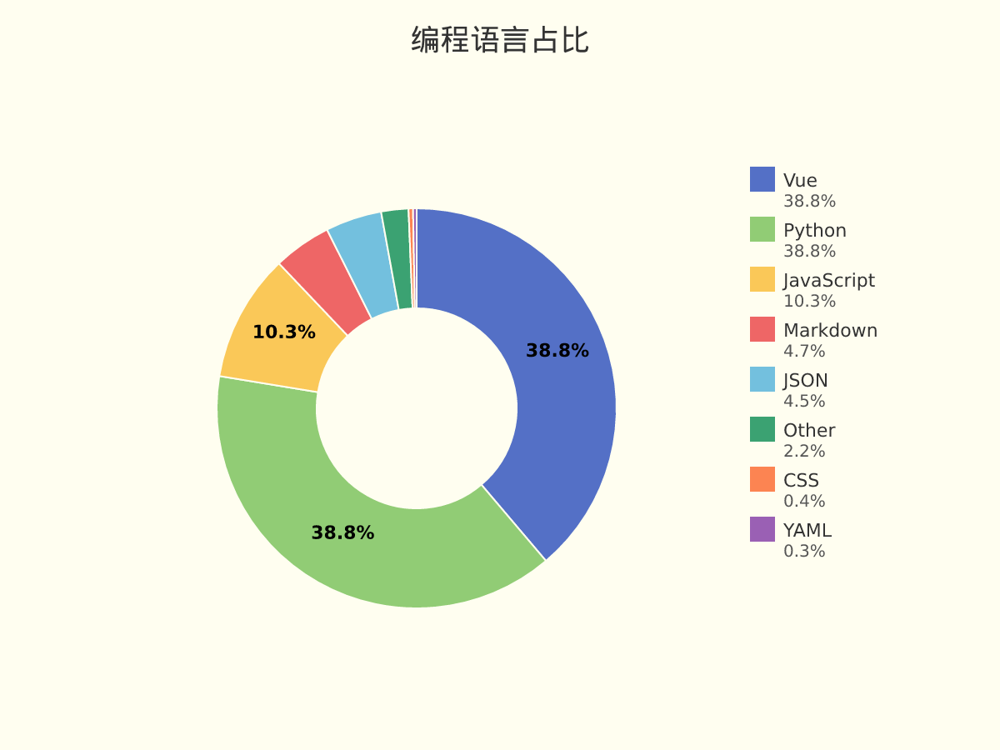
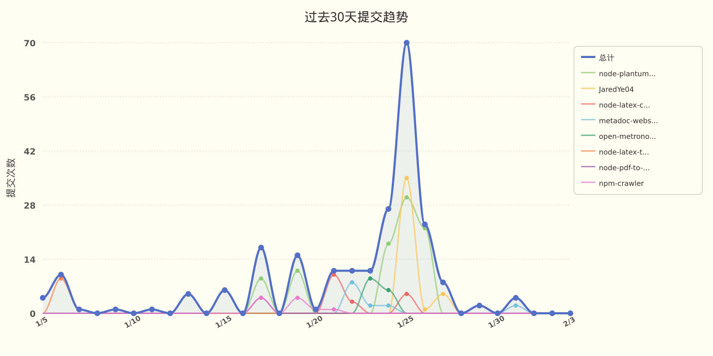

# JaredYe04 的个人主页

欢迎来到我的世界。
这里没有终点，只有不断逼近的答案。

我用代码书写思考，用重构回应混乱，
在技术与创造之间，寻找前进的方向。

这是 JaredYe's World ——
一个持续生长的空间，
也是我与未来对话的方式。

每一次运行，
都是对明天的调用。


###  📊 **过去七天我的编程活动统计**

```
💬 编程语言: 
Vue            	5 小时 55 分钟          	███████████████████░░░░░░░░░░░░░░░░░░░░░░░░░░░░░░░	38.81 %
Python         	5 小时 54 分钟          	███████████████████░░░░░░░░░░░░░░░░░░░░░░░░░░░░░░░	38.77 %
JavaScript     	1 小时 34 分钟          	█████░░░░░░░░░░░░░░░░░░░░░░░░░░░░░░░░░░░░░░░░░░░░░	10.32 %
Markdown       	42 分钟               	██░░░░░░░░░░░░░░░░░░░░░░░░░░░░░░░░░░░░░░░░░░░░░░░░	4.69 %
JSON           	41 分钟               	██░░░░░░░░░░░░░░░░░░░░░░░░░░░░░░░░░░░░░░░░░░░░░░░░	4.55 %
Other          	20 分钟               	█░░░░░░░░░░░░░░░░░░░░░░░░░░░░░░░░░░░░░░░░░░░░░░░░░	2.20 %
CSS            	3 分钟                	░░░░░░░░░░░░░░░░░░░░░░░░░░░░░░░░░░░░░░░░░░░░░░░░░░	0.36 %
YAML           	2 分钟                	░░░░░░░░░░░░░░░░░░░░░░░░░░░░░░░░░░░░░░░░░░░░░░░░░░	0.29 %

⏱️ 使用电脑时间: 
总计 15 小时 14 分钟

📝 代码统计: 
总代码行数 (LOC)      2,770 行
提交次数               14 次
活跃仓库数             4 个
```

###  📊 **编程语言占比**

<picture>
  <source media="(prefers-color-scheme: dark)" srcset="images/language-pie-dark-08414ded2c3d.png">
  
</picture>

###  📊 **主页浏览量**

  


  📈 **过去30天提交趋势**

<picture>
  <source media="(prefers-color-scheme: dark)" srcset="images/commit-trend-dark-03c3f1f04d35.png">
  
</picture>


<picture>
  <source media="(prefers-color-scheme: dark)" srcset="https://raw.githubusercontent.com/JaredYe04/JaredYe04/main/output/github-contribution-grid-snake-dark.svg">
  
</picture>

---

**最后更新**: 2026年02月03日 14:45:52 (UTC+8)

