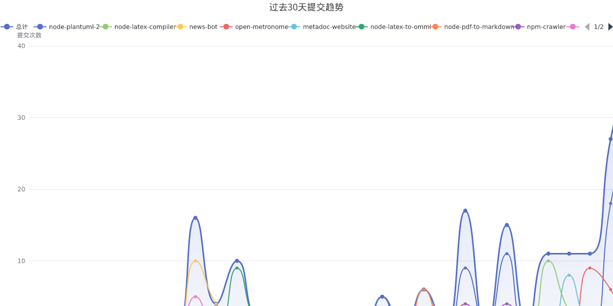

# JaredYe04 wakatime Profile Views

Welcome to my world... perhaps it still needs more time to be perfected.

My website: JaredYe's World, to grope for an answer why we move forward.

**I would be glad if you could walk with me, in search of the light that guides our way ahead.**

It's a new day, also a new summons to struggle.

|  |  |
| --------------------------------------------------------------------------------------------------------------------------------------------------------------------------------------------------------------------------------------------------------------------------------------------------------------------------------------------------------------------------------------------------------------------------------------------------------------------- | ------------------------------------------------------------------------------------------------------------------------------------------------------------------------------------------------------------------------------------------------------------------------------------------------------------------------------------------------------------------------------------------------------------------------------------------------------------------- |

📊 **本周我的编程活动统计**

```
💬 编程语言: 
CSS            	10 分钟               	░░░░░░░░░░░░░░░░░░░░░░░░░░░░░░░░░░░░░░░░░░░░░░░░░░	0.34 %
HTML           	1 分钟                	░░░░░░░░░░░░░░░░░░░░░░░░░░░░░░░░░░░░░░░░░░░░░░░░░░	0.04 %
Java           	1 分钟                	░░░░░░░░░░░░░░░░░░░░░░░░░░░░░░░░░░░░░░░░░░░░░░░░░░	0.04 %
JavaScript     	26 小时 45 分钟         	██████████████████████████░░░░░░░░░░░░░░░░░░░░░░░░	52.24 %
JSON           	1 小时 13 分钟          	█░░░░░░░░░░░░░░░░░░░░░░░░░░░░░░░░░░░░░░░░░░░░░░░░░	2.39 %
Markdown       	5 小时 49 分钟          	█████░░░░░░░░░░░░░░░░░░░░░░░░░░░░░░░░░░░░░░░░░░░░░	11.37 %
Other          	2 小时 21 分钟          	██░░░░░░░░░░░░░░░░░░░░░░░░░░░░░░░░░░░░░░░░░░░░░░░░	4.60 %
PowerShell     	1 分钟                	░░░░░░░░░░░░░░░░░░░░░░░░░░░░░░░░░░░░░░░░░░░░░░░░░░	0.06 %
Shell          	5 分钟                	░░░░░░░░░░░░░░░░░░░░░░░░░░░░░░░░░░░░░░░░░░░░░░░░░░	0.17 %
TypeScript     	11 分钟               	░░░░░░░░░░░░░░░░░░░░░░░░░░░░░░░░░░░░░░░░░░░░░░░░░░	0.39 %

⏱️ 使用电脑时间: 
总计 51 小时 13 分钟

📝 代码统计: 
总代码行数 (LOC)      10,936 行
提交次数               115 次
活跃仓库数             7 个
```


📊 **编程语言占比**


📈 **过去30天提交趋势**




> ⏱️ 活动数据基于 GitHub 事件推断（无需 IDE 插件）


## About

 Config files for my GitHub profile.

github.com/JaredYe04 

