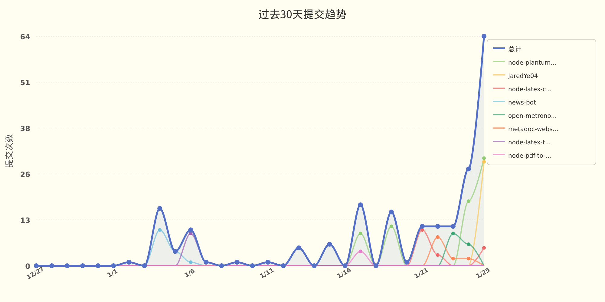

# JaredYe04 的个人主页

欢迎来到我的世界。
这里没有终点，只有不断逼近的答案。

我用代码书写思考，用重构回应混乱，
在技术与创造之间，寻找前进的方向。

这是 JaredYe's World ——
一个持续生长的空间，
也是我与未来对话的方式。

每一次运行，
都是对明天的调用。

**主页浏览量**


📊 **过去七天我的编程活动统计**

```
💬 编程语言: 
JavaScript     	29 小时 42 分钟         	████████████████████████████░░░░░░░░░░░░░░░░░░░░░░	58.00 %
Markdown       	8 小时 20 分钟          	████████░░░░░░░░░░░░░░░░░░░░░░░░░░░░░░░░░░░░░░░░░░	16.28 %
YAML           	4 小时 50 分钟          	████░░░░░░░░░░░░░░░░░░░░░░░░░░░░░░░░░░░░░░░░░░░░░░	9.47 %
Vue            	3 小时 12 分钟          	███░░░░░░░░░░░░░░░░░░░░░░░░░░░░░░░░░░░░░░░░░░░░░░░	6.26 %
Other          	2 小时 21 分钟          	██░░░░░░░░░░░░░░░░░░░░░░░░░░░░░░░░░░░░░░░░░░░░░░░░	4.59 %
JSON           	2 小时 10 分钟          	██░░░░░░░░░░░░░░░░░░░░░░░░░░░░░░░░░░░░░░░░░░░░░░░░	4.24 %
TypeScript     	11 分钟               	░░░░░░░░░░░░░░░░░░░░░░░░░░░░░░░░░░░░░░░░░░░░░░░░░░	0.38 %
CSS            	10 分钟               	░░░░░░░░░░░░░░░░░░░░░░░░░░░░░░░░░░░░░░░░░░░░░░░░░░	0.34 %
Shell          	7 分钟                	░░░░░░░░░░░░░░░░░░░░░░░░░░░░░░░░░░░░░░░░░░░░░░░░░░	0.26 %
Java           	2 分钟                	░░░░░░░░░░░░░░░░░░░░░░░░░░░░░░░░░░░░░░░░░░░░░░░░░░	0.08 %

⏱️ 使用电脑时间: 
总计 51 小时 13 分钟

📝 代码统计: 
总代码行数 (LOC)      9,893 行
提交次数               140 次
活跃仓库数             7 个
```

📊 **编程语言占比**

<picture>
  <source media="(prefers-color-scheme: dark)" srcset="images/language-pie-dark-f21b7ef81d8d.png">
  
</picture>

📈 **过去30天提交趋势**

<picture>
  <source media="(prefers-color-scheme: dark)" srcset="images/commit-trend-dark-fca029917d0d.png">
  
</picture>


<picture>
  <source media="(prefers-color-scheme: dark)" srcset="https://raw.githubusercontent.com/JaredYe04/JaredYe04/main/output/github-contribution-grid-snake-dark.svg">
  
</picture>

