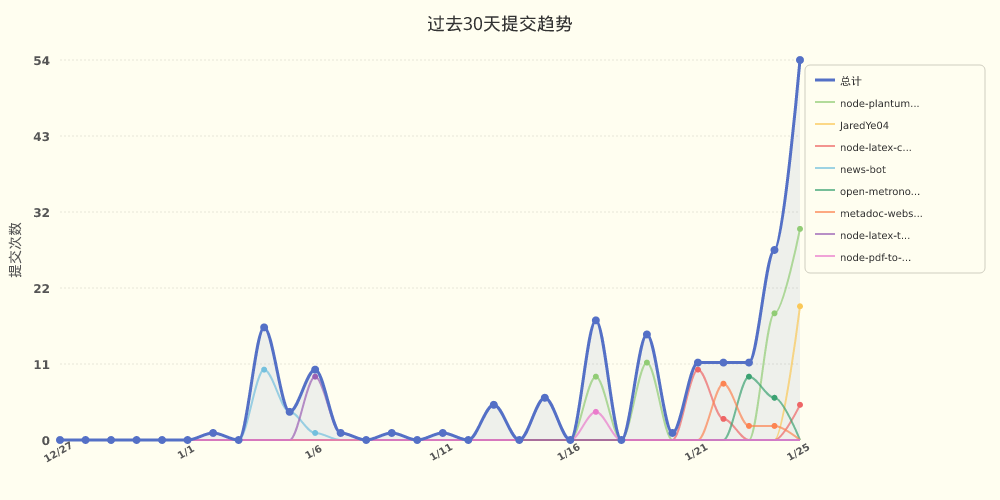

<div lang="zh-CN">

# JaredYe04 的个人主页

欢迎来到我的世界。
这里没有终点，只有不断逼近的答案。

我用代码书写思考，用重构回应混乱，
在技术与创造之间，寻找前进的方向。

这是 JaredYe's World ——
一个持续生长的空间，
也是我与未来对话的方式。

每一次运行，
都是对明天的调用。

</div>

<div lang="en" style="display: none;">

# JaredYe04's Profile

Welcome to my world.
There is no end, only answers that keep approaching.

I write thoughts with code, respond to chaos with refactors,
seeking the way forward between technology and creation.

This is JaredYe's World ——
a continuously growing space,
and my way of conversing with the future.

Every execution,
is a call to tomorrow.

</div>

<!-- 语言切换样式 -->
<style>
html[lang="zh-CN"] div[lang="en"],
html[lang="zh"] div[lang="en"],
html[lang="zh-Hans"] div[lang="en"],
html[lang="zh-Hant"] div[lang="en"] {
  display: none !important;
}
html[lang="en"] div[lang="zh-CN"],
html[lang="en-US"] div[lang="zh-CN"],
html[lang="en-GB"] div[lang="zh-CN"] {
  display: none !important;
}
/* 默认显示中文 */
div[lang="en"] {
  display: none !important;
}
</style>

<div lang="zh-CN">

📊 **过去七天我的编程活动统计**

```
💬 编程语言: 
JavaScript     	29 小时 13 分钟         	████████████████████████████░░░░░░░░░░░░░░░░░░░░░░	57.05 %
Markdown       	7 小时 33 分钟          	███████░░░░░░░░░░░░░░░░░░░░░░░░░░░░░░░░░░░░░░░░░░░	14.74 %
YAML           	6 小时 35 分钟          	██████░░░░░░░░░░░░░░░░░░░░░░░░░░░░░░░░░░░░░░░░░░░░	12.87 %
Vue            	3 小时 2 分钟           	██░░░░░░░░░░░░░░░░░░░░░░░░░░░░░░░░░░░░░░░░░░░░░░░░	5.92 %
Other          	2 小时 13 分钟          	██░░░░░░░░░░░░░░░░░░░░░░░░░░░░░░░░░░░░░░░░░░░░░░░░	4.35 %
JSON           	2 小时 3 分钟           	██░░░░░░░░░░░░░░░░░░░░░░░░░░░░░░░░░░░░░░░░░░░░░░░░	4.01 %
TypeScript     	11 分钟               	░░░░░░░░░░░░░░░░░░░░░░░░░░░░░░░░░░░░░░░░░░░░░░░░░░	0.36 %
CSS            	9 分钟                	░░░░░░░░░░░░░░░░░░░░░░░░░░░░░░░░░░░░░░░░░░░░░░░░░░	0.32 %
Shell          	6 分钟                	░░░░░░░░░░░░░░░░░░░░░░░░░░░░░░░░░░░░░░░░░░░░░░░░░░	0.21 %
Java           	1 分钟                	░░░░░░░░░░░░░░░░░░░░░░░░░░░░░░░░░░░░░░░░░░░░░░░░░░	0.06 %

⏱️ 使用电脑时间: 
总计 51 小时 13 分钟

📝 代码统计: 
总代码行数 (LOC)      11,060 行
提交次数               130 次
活跃仓库数             7 个
```


📊 **编程语言占比**

<picture>
  <source media="(prefers-color-scheme: dark)" srcset="images/language-pie-dark-eb5dd9a190f1.png">
  
</picture>

<div lang="zh-CN">
📈 **过去30天提交趋势**
</div>
<div lang="en" style="display: none;">
📈 **Commit Trends (Past 30 Days)**
</div>

<picture>
  <source media="(prefers-color-scheme: dark)" srcset="images/commit-trend-dark-795a9be2511b.png">
  
</picture>


> ⏱️ 活动数据基于 GitHub 事件推断（无需 IDE 插件）

</div>

<div lang="en" style="display: none;">

📊 **My Coding Activity (Past 7 Days)**

```
💬 Programming Languages: 
JavaScript     	29h 13m             	████████████████████████████░░░░░░░░░░░░░░░░░░░░░░	57.05 %
Markdown       	7h 33m              	███████░░░░░░░░░░░░░░░░░░░░░░░░░░░░░░░░░░░░░░░░░░░	14.74 %
YAML           	6h 35m              	██████░░░░░░░░░░░░░░░░░░░░░░░░░░░░░░░░░░░░░░░░░░░░	12.87 %
Vue            	3h 2m               	██░░░░░░░░░░░░░░░░░░░░░░░░░░░░░░░░░░░░░░░░░░░░░░░░	5.92 %
Other          	2h 13m              	██░░░░░░░░░░░░░░░░░░░░░░░░░░░░░░░░░░░░░░░░░░░░░░░░	4.35 %
JSON           	2h 3m               	██░░░░░░░░░░░░░░░░░░░░░░░░░░░░░░░░░░░░░░░░░░░░░░░░	4.01 %
TypeScript     	11m                 	░░░░░░░░░░░░░░░░░░░░░░░░░░░░░░░░░░░░░░░░░░░░░░░░░░	0.36 %
CSS            	9m                  	░░░░░░░░░░░░░░░░░░░░░░░░░░░░░░░░░░░░░░░░░░░░░░░░░░	0.32 %
Shell          	6m                  	░░░░░░░░░░░░░░░░░░░░░░░░░░░░░░░░░░░░░░░░░░░░░░░░░░	0.21 %
Java           	1m                  	░░░░░░░░░░░░░░░░░░░░░░░░░░░░░░░░░░░░░░░░░░░░░░░░░░	0.06 %

⏱️ Computer Usage Time: 
Total 51 hours 13 minutes

📝 Code Statistics: 
Total Lines of Code (LOC)      11,060 lines
Commits                        130 times
Active Repositories            7 repos
```


📊 **编程语言占比**

<picture>
  <source media="(prefers-color-scheme: dark)" srcset="images/language-pie-dark-eb5dd9a190f1.png">
  
</picture>

<div lang="zh-CN">
📈 **过去30天提交趋势**
</div>
<div lang="en" style="display: none;">
📈 **Commit Trends (Past 30 Days)**
</div>

<picture>
  <source media="(prefers-color-scheme: dark)" srcset="images/commit-trend-dark-795a9be2511b.png">
  
</picture>


> ⏱️ Activity data inferred from GitHub events (no IDE plugins required)

</div>


<picture>
  <source media="(prefers-color-scheme: dark)" srcset="https://raw.githubusercontent.com/JaredYe04/JaredYe04/main/output/github-contribution-grid-snake-dark.svg">
  
</picture>

