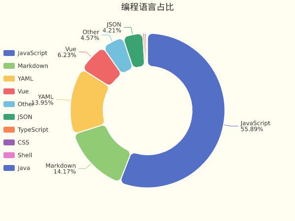
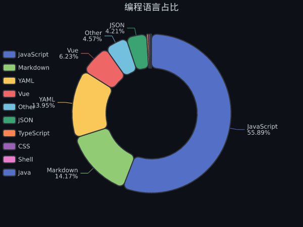

# JaredYe04 的个人主页

欢迎来到我的世界。
这里没有终点，只有不断逼近的答案。

我用代码书写思考，用系统回应复杂，
在技术与创造之间，寻找前进的方向。

这是 JaredYe's World ——
一个持续生长的空间，
也是我与未来对话的方式。

每一次运行，
都是对明天的调用。

<table>
  <tr>
    <td>
      <picture>
        <source media="(prefers-color-scheme: dark)" srcset="https://api.diraw.top/github/stats?username=JaredYe04&theme=transparent&include_all_commits=true&show_icons=true&hide_border=true&hide_title=true&text_size=16&text_color=c9d1d9&icon_color=c9d1d9&hide=contribs">
        <source media="(prefers-color-scheme: light)" srcset="https://api.diraw.top/github/stats?username=JaredYe04&theme=transparent&include_all_commits=true&show_icons=true&hide_border=true&hide_title=true&text_size=16&text_color=333333&icon_color=333333&hide=contribs">
        
      </picture>
    </td>
    <td>
      <picture>
        <source media="(prefers-color-scheme: dark)" srcset="https://api.diraw.top/github/stats/wakatime?username=JaredYe04&theme=transparent&hide_border=true&layout=compact&langs_count=6&hide_title=true&text_size=20&text_color=c9d1d9&icon_color=c9d1d9">
        <source media="(prefers-color-scheme: light)" srcset="https://api.diraw.top/github/stats/wakatime?username=JaredYe04&theme=transparent&hide_border=true&layout=compact&langs_count=6&hide_title=true&text_size=20&text_color=333333&icon_color=333333">
        
      </picture>
    </td>
  </tr>
</table>

<div align="center">
  <picture>
    <source media="(prefers-color-scheme: dark)" srcset="https://wakatime.com/share/@JaredYe04/b1603ee0-000a-43bd-b17b-e98288bbc052.svg">
    <source media="(prefers-color-scheme: light)" srcset="https://wakatime.com/share/@JaredYe04/f2012205-2e27-4aa6-ab20-69906005c91a.svg">
    
  </picture>
</div>

📊 **过去七天我的编程活动统计**

```
💬 编程语言: 
JavaScript     	28 小时 36 分钟         	███████████████████████████░░░░░░░░░░░░░░░░░░░░░░░	55.84 %
Markdown       	7 小时 14 分钟          	███████░░░░░░░░░░░░░░░░░░░░░░░░░░░░░░░░░░░░░░░░░░░	14.15 %
YAML           	7 小时 8 分钟           	██████░░░░░░░░░░░░░░░░░░░░░░░░░░░░░░░░░░░░░░░░░░░░	13.94 %
Vue            	3 小时 11 分钟          	███░░░░░░░░░░░░░░░░░░░░░░░░░░░░░░░░░░░░░░░░░░░░░░░	6.22 %
Other          	2 小时 20 分钟          	██░░░░░░░░░░░░░░░░░░░░░░░░░░░░░░░░░░░░░░░░░░░░░░░░	4.57 %
JSON           	2 小时 9 分钟           	██░░░░░░░░░░░░░░░░░░░░░░░░░░░░░░░░░░░░░░░░░░░░░░░░	4.20 %
TypeScript     	11 分钟               	░░░░░░░░░░░░░░░░░░░░░░░░░░░░░░░░░░░░░░░░░░░░░░░░░░	0.38 %
CSS            	10 分钟               	░░░░░░░░░░░░░░░░░░░░░░░░░░░░░░░░░░░░░░░░░░░░░░░░░░	0.33 %
Shell          	6 分钟                	░░░░░░░░░░░░░░░░░░░░░░░░░░░░░░░░░░░░░░░░░░░░░░░░░░	0.21 %
Java           	1 分钟                	░░░░░░░░░░░░░░░░░░░░░░░░░░░░░░░░░░░░░░░░░░░░░░░░░░	0.06 %

⏱️ 使用电脑时间: 
总计 51 小时 13 分钟

📝 代码统计: 
总代码行数 (LOC)      10,545 行
提交次数               127 次
活跃仓库数             7 个

👁️ 仓库访问: 统计中...（个人资料主页访问统计见下方徽章）
```


📊 **编程语言占比**



<!-- 深色模式版本 -->



📈 **过去30天提交趋势**

<picture>
  <source media="(prefers-color-scheme: dark)" srcset="images/commit-trend-dark-5b58a4375689.png">
  
</picture>


> ⏱️ 活动数据基于 GitHub 事件推断（无需 IDE 插件）

<div align="center">
  
</div>

<picture>
  <source media="(prefers-color-scheme: dark)" srcset="https://raw.githubusercontent.com/JaredYe04/JaredYe04/main/output/github-contribution-grid-snake-dark.svg">
  
</picture>

