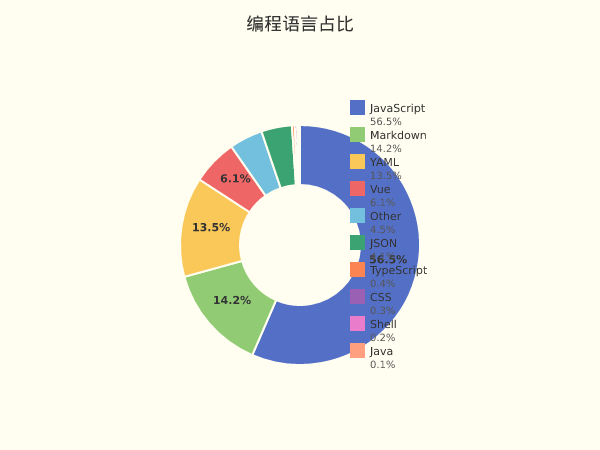
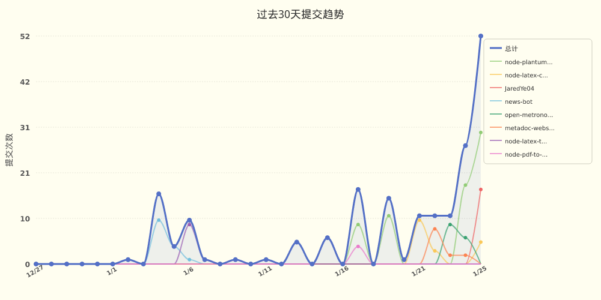

<div lang="zh-CN">

# JaredYe04 的个人主页

欢迎来到我的世界。
这里没有终点，只有不断逼近的答案。

我用代码书写思考，用系统回应复杂，
在技术与创造之间，寻找前进的方向。

这是 JaredYe's World ——
一个持续生长的空间，
也是我与未来对话的方式。

每一次运行，
都是对明天的调用。

</div>

<div lang="en" style="display: none;">

# JaredYe04's Profile

Welcome to my world.
There is no end, only answers that keep approaching.

I write thoughts with code, respond to complexity with systems,
seeking the way forward between technology and creation.

This is JaredYe's World ——
a continuously growing space,
and my way of conversing with the future.

Every execution,
is a call to tomorrow.

</div>

<style>
  html[lang="zh-CN"] div[lang="en"],
  html[lang="zh"] div[lang="en"],
  html[lang="zh-Hans"] div[lang="en"],
  html[lang="zh-Hant"] div[lang="en"] {
    display: none !important;
  }
  html[lang="en"] div[lang="zh-CN"],
  html[lang="en-US"] div[lang="zh-CN"],
  html[lang="en-GB"] div[lang="zh-CN"] {
    display: none !important;
  }
  /* 默认显示中文 */
  div[lang="en"] {
    display: none !important;
  }
</style>

<div lang="zh-CN">

📊 **过去七天我的编程活动统计**

```
💬 编程语言: 
JavaScript     	28 小时 56 分钟         	████████████████████████████░░░░░░░░░░░░░░░░░░░░░░	56.51 %
Markdown       	7 小时 16 分钟          	███████░░░░░░░░░░░░░░░░░░░░░░░░░░░░░░░░░░░░░░░░░░░	14.22 %
YAML           	6 小时 53 分钟          	██████░░░░░░░░░░░░░░░░░░░░░░░░░░░░░░░░░░░░░░░░░░░░	13.46 %
Vue            	3 小时 8 分钟           	███░░░░░░░░░░░░░░░░░░░░░░░░░░░░░░░░░░░░░░░░░░░░░░░	6.12 %
Other          	2 小时 18 分钟          	██░░░░░░░░░░░░░░░░░░░░░░░░░░░░░░░░░░░░░░░░░░░░░░░░	4.49 %
JSON           	2 小时 6 分钟           	██░░░░░░░░░░░░░░░░░░░░░░░░░░░░░░░░░░░░░░░░░░░░░░░░	4.13 %
TypeScript     	11 分钟               	░░░░░░░░░░░░░░░░░░░░░░░░░░░░░░░░░░░░░░░░░░░░░░░░░░	0.38 %
CSS            	10 分钟               	░░░░░░░░░░░░░░░░░░░░░░░░░░░░░░░░░░░░░░░░░░░░░░░░░░	0.33 %
Shell          	6 分钟                	░░░░░░░░░░░░░░░░░░░░░░░░░░░░░░░░░░░░░░░░░░░░░░░░░░	0.21 %
Java           	1 分钟                	░░░░░░░░░░░░░░░░░░░░░░░░░░░░░░░░░░░░░░░░░░░░░░░░░░	0.06 %

⏱️ 使用电脑时间: 
总计 51 小时 13 分钟

📝 代码统计: 
总代码行数 (LOC)      10,719 行
提交次数               128 次
活跃仓库数             7 个

👁️ 仓库访问: 统计中...
```


📊 **编程语言占比**

<picture>
  <source media="(prefers-color-scheme: dark)" srcset="images/language-pie-dark-d1d18660629b.png">
  
</picture>

<div lang="zh-CN">
📈 **过去30天提交趋势**
</div>
<div lang="en" style="display: none;">
📈 **Commit Trends (Past 30 Days)**
</div>

<picture>
  <source media="(prefers-color-scheme: dark)" srcset="images/commit-trend-dark-d79854bdbc99.png">
  
</picture>


> ⏱️ 活动数据基于 GitHub 事件推断（无需 IDE 插件）

</div>

<div lang="en" style="display: none;">

📊 **My Coding Activity (Past 7 Days)**

```
💬 Programming Languages: 
JavaScript     	28h 56m             	████████████████████████████░░░░░░░░░░░░░░░░░░░░░░	56.51 %
Markdown       	7h 16m              	███████░░░░░░░░░░░░░░░░░░░░░░░░░░░░░░░░░░░░░░░░░░░	14.22 %
YAML           	6h 53m              	██████░░░░░░░░░░░░░░░░░░░░░░░░░░░░░░░░░░░░░░░░░░░░	13.46 %
Vue            	3h 8m               	███░░░░░░░░░░░░░░░░░░░░░░░░░░░░░░░░░░░░░░░░░░░░░░░	6.12 %
Other          	2h 18m              	██░░░░░░░░░░░░░░░░░░░░░░░░░░░░░░░░░░░░░░░░░░░░░░░░	4.49 %
JSON           	2h 6m               	██░░░░░░░░░░░░░░░░░░░░░░░░░░░░░░░░░░░░░░░░░░░░░░░░	4.13 %
TypeScript     	11m                 	░░░░░░░░░░░░░░░░░░░░░░░░░░░░░░░░░░░░░░░░░░░░░░░░░░	0.38 %
CSS            	10m                 	░░░░░░░░░░░░░░░░░░░░░░░░░░░░░░░░░░░░░░░░░░░░░░░░░░	0.33 %
Shell          	6m                  	░░░░░░░░░░░░░░░░░░░░░░░░░░░░░░░░░░░░░░░░░░░░░░░░░░	0.21 %
Java           	1m                  	░░░░░░░░░░░░░░░░░░░░░░░░░░░░░░░░░░░░░░░░░░░░░░░░░░	0.06 %

⏱️ Computer Usage Time: 
Total 51 hours 13 minutes

📝 Code Statistics: 
Total Lines of Code (LOC)      10,719 lines
Commits                        128 times
Active Repositories            7 repos

👁️ Repository Views: Loading...
```


📊 **编程语言占比**

<picture>
  <source media="(prefers-color-scheme: dark)" srcset="images/language-pie-dark-d1d18660629b.png">
  
</picture>

<div lang="zh-CN">
📈 **过去30天提交趋势**
</div>
<div lang="en" style="display: none;">
📈 **Commit Trends (Past 30 Days)**
</div>

<picture>
  <source media="(prefers-color-scheme: dark)" srcset="images/commit-trend-dark-d79854bdbc99.png">
  
</picture>


> ⏱️ Activity data inferred from GitHub events (no IDE plugins required)

</div>


<picture>
  <source media="(prefers-color-scheme: dark)" srcset="https://raw.githubusercontent.com/JaredYe04/JaredYe04/main/output/github-contribution-grid-snake-dark.svg">
  
</picture>

