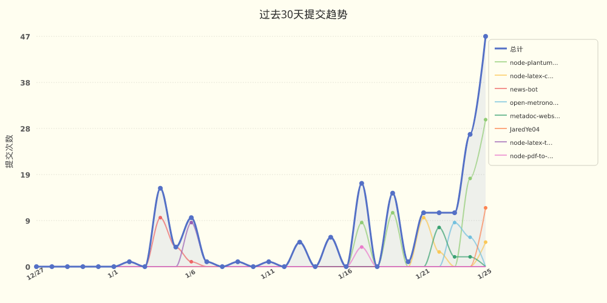
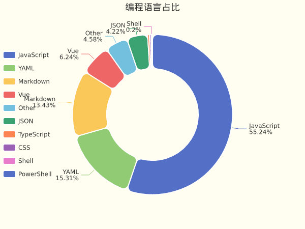
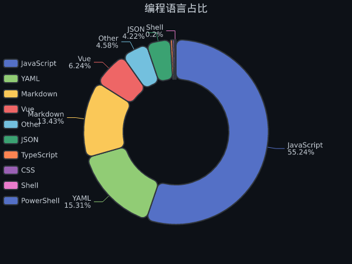
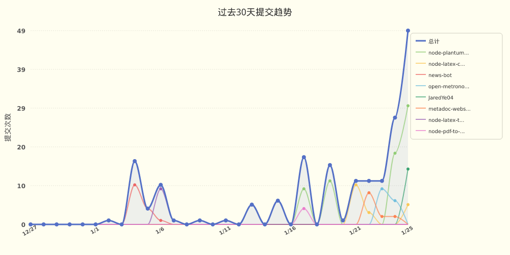

# JaredYe04 的个人主页

欢迎来到我的世界。
这里没有终点，只有不断逼近的答案。

我用代码书写思考，用系统回应复杂，
在技术与创造之间，寻找前进的方向。

这是 JaredYe’s World ——
一个持续生长的空间，
也是我与未来对话的方式。

每一次运行，
都是对明天的调用。

📊 **本周我的编程活动统计**

```
💬 编程语言: 
（本周暂无代码活动）

⏱️ 使用电脑时间: 
总计 0 小时 0 分钟

📝 代码统计: 
总代码行数 (LOC)      0 行
提交次数               0 次
活跃仓库数             0 个
```


📈 **过去30天提交趋势**




> ⏱️ 活动数据基于 GitHub 事件推断（无需 IDE 插件）

<picture>
  <source media="(prefers-color-scheme: dark)" srcset="https://raw.githubusercontent.com/JaredYe04/JaredYe04/main/output/github-contribution-grid-snake-dark.svg">
  
</picture>


📊 **过去七天我的编程活动统计**

```
💬 编程语言: 
JavaScript     	28 小时 15 分钟         	███████████████████████████░░░░░░░░░░░░░░░░░░░░░░░	55.18 %
YAML           	7 小时 50 分钟          	███████░░░░░░░░░░░░░░░░░░░░░░░░░░░░░░░░░░░░░░░░░░░	15.30 %
Markdown       	6 小时 52 分钟          	██████░░░░░░░░░░░░░░░░░░░░░░░░░░░░░░░░░░░░░░░░░░░░	13.42 %
Vue            	3 小时 11 分钟          	███░░░░░░░░░░░░░░░░░░░░░░░░░░░░░░░░░░░░░░░░░░░░░░░	6.24 %
Other          	2 小时 20 分钟          	██░░░░░░░░░░░░░░░░░░░░░░░░░░░░░░░░░░░░░░░░░░░░░░░░	4.58 %
JSON           	2 小时 9 分钟           	██░░░░░░░░░░░░░░░░░░░░░░░░░░░░░░░░░░░░░░░░░░░░░░░░	4.21 %
TypeScript     	11 分钟               	░░░░░░░░░░░░░░░░░░░░░░░░░░░░░░░░░░░░░░░░░░░░░░░░░░	0.38 %
CSS            	10 分钟               	░░░░░░░░░░░░░░░░░░░░░░░░░░░░░░░░░░░░░░░░░░░░░░░░░░	0.33 %
Shell          	6 分钟                	░░░░░░░░░░░░░░░░░░░░░░░░░░░░░░░░░░░░░░░░░░░░░░░░░░	0.20 %
PowerShell     	1 分钟                	░░░░░░░░░░░░░░░░░░░░░░░░░░░░░░░░░░░░░░░░░░░░░░░░░░	0.06 %

⏱️ 使用电脑时间: 
总计 51 小时 13 分钟

📝 代码统计: 
总代码行数 (LOC)      10,601 行
提交次数               125 次
活跃仓库数             7 个

👁️ 主页访问: 统计中...
```


📊 **编程语言占比**



<!-- 深色模式版本 -->



📈 **过去30天提交趋势**

<picture>
  <source media="(prefers-color-scheme: dark)" srcset="images/commit-trend-dark-428c6b981d97.png">
  
</picture>


> ⏱️ 活动数据基于 GitHub 事件推断（无需 IDE 插件）