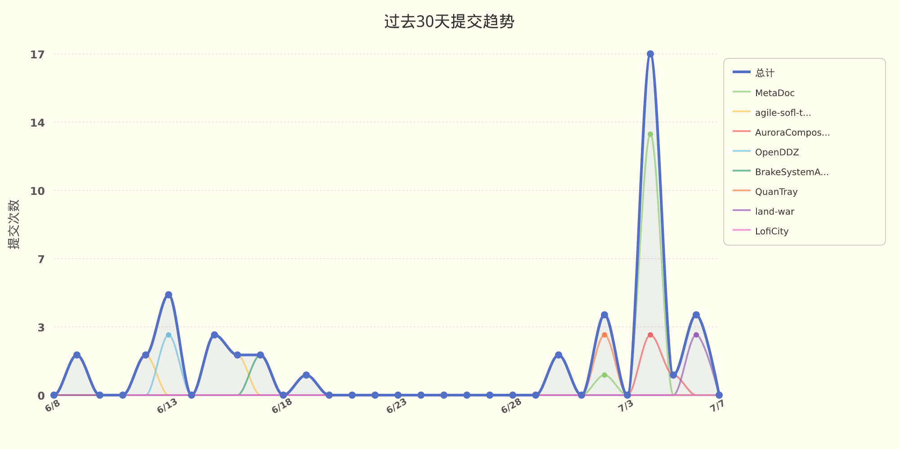

# JaredYe04 的个人主页

欢迎来到我的世界。
这里没有终点，只有不断逼近的答案。

我用代码书写思考，用重构回应混乱，
在技术与创造之间，寻找前进的方向。

这是 JaredYe's World ——
一个持续生长的空间，
也是我与未来对话的方式。

每一次运行，
都是对明天的调用。


###  📊 **过去七天我的编程活动统计**

```
💬 编程语言: 
JSON           	7 小时 45 分钟          	██████████████░░░░░░░░░░░░░░░░░░░░░░░░░░░░░░░░░░░░	28.93 %
Markdown       	5 小时 13 分钟          	█████████░░░░░░░░░░░░░░░░░░░░░░░░░░░░░░░░░░░░░░░░░	19.46 %
Rust           	3 小时 2 分钟           	█████░░░░░░░░░░░░░░░░░░░░░░░░░░░░░░░░░░░░░░░░░░░░░	11.37 %
JavaScript     	2 小时 29 分钟          	████░░░░░░░░░░░░░░░░░░░░░░░░░░░░░░░░░░░░░░░░░░░░░░	9.32 %
TypeScript     	2 小时 14 分钟          	████░░░░░░░░░░░░░░░░░░░░░░░░░░░░░░░░░░░░░░░░░░░░░░	8.39 %
Python         	2 小时 8 分钟           	████░░░░░░░░░░░░░░░░░░░░░░░░░░░░░░░░░░░░░░░░░░░░░░	8.01 %
Other          	1 小时 34 分钟          	██░░░░░░░░░░░░░░░░░░░░░░░░░░░░░░░░░░░░░░░░░░░░░░░░	5.85 %
Vue            	1 小时 13 分钟          	██░░░░░░░░░░░░░░░░░░░░░░░░░░░░░░░░░░░░░░░░░░░░░░░░	4.56 %
Tex            	1 小时 6 分钟           	██░░░░░░░░░░░░░░░░░░░░░░░░░░░░░░░░░░░░░░░░░░░░░░░░	4.12 %

⏱️ 使用电脑时间: 
总计 26 小时 48 分钟

📝 代码统计: 
总代码行数 (LOC)      230,504 行
提交次数               28 次
活跃仓库数             6 个
```

###  📊 **编程语言占比**

<picture>
  <source media="(prefers-color-scheme: dark)" srcset="images/language-pie-dark-25cc0c4c80e8.png">
  
</picture>

###  📊 **主页浏览量**

  


  📈 **过去30天提交趋势**

<picture>
  <source media="(prefers-color-scheme: dark)" srcset="images/commit-trend-dark-694db90d8e87.png">
  
</picture>


<picture>
  <source media="(prefers-color-scheme: dark)" srcset="https://raw.githubusercontent.com/JaredYe04/JaredYe04/main/output/github-contribution-grid-snake-dark.svg">
  
</picture>

---

**最后更新**: 2026年07月07日 10:27:35 (UTC+8)

