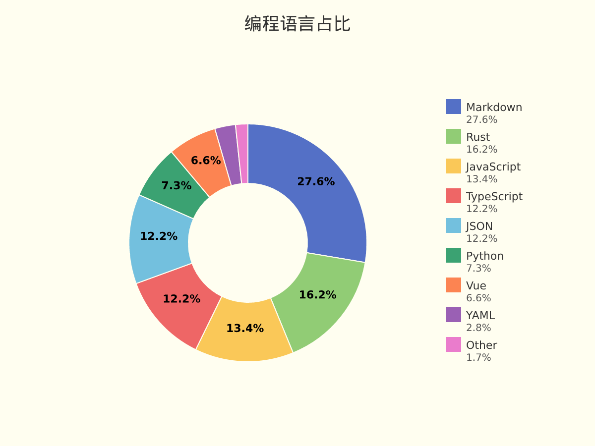
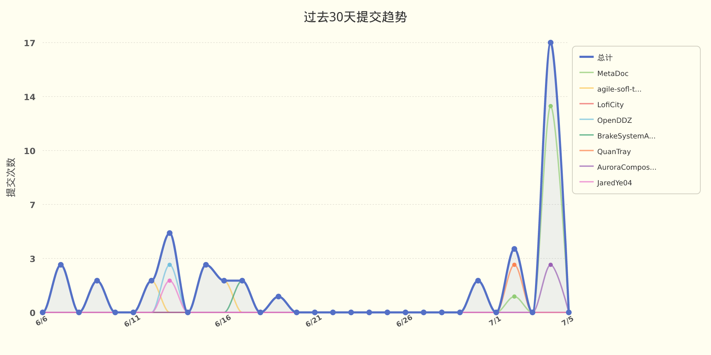

# JaredYe04 的个人主页

欢迎来到我的世界。
这里没有终点，只有不断逼近的答案。

我用代码书写思考，用重构回应混乱，
在技术与创造之间，寻找前进的方向。

这是 JaredYe's World ——
一个持续生长的空间，
也是我与未来对话的方式。

每一次运行，
都是对明天的调用。


###  📊 **过去七天我的编程活动统计**

```
💬 编程语言: 
Markdown       	6 小时 36 分钟          	█████████████░░░░░░░░░░░░░░░░░░░░░░░░░░░░░░░░░░░░░	27.65 %
Rust           	3 小时 51 分钟          	████████░░░░░░░░░░░░░░░░░░░░░░░░░░░░░░░░░░░░░░░░░░	16.15 %
JavaScript     	3 小时 12 分钟          	██████░░░░░░░░░░░░░░░░░░░░░░░░░░░░░░░░░░░░░░░░░░░░	13.43 %
TypeScript     	2 小时 55 分钟          	██████░░░░░░░░░░░░░░░░░░░░░░░░░░░░░░░░░░░░░░░░░░░░	12.21 %
JSON           	2 小时 54 分钟          	██████░░░░░░░░░░░░░░░░░░░░░░░░░░░░░░░░░░░░░░░░░░░░	12.18 %
Python         	1 小时 44 分钟          	███░░░░░░░░░░░░░░░░░░░░░░░░░░░░░░░░░░░░░░░░░░░░░░░	7.26 %
Vue            	1 小时 35 分钟          	███░░░░░░░░░░░░░░░░░░░░░░░░░░░░░░░░░░░░░░░░░░░░░░░	6.64 %
YAML           	40 分钟               	█░░░░░░░░░░░░░░░░░░░░░░░░░░░░░░░░░░░░░░░░░░░░░░░░░	2.81 %
Other          	24 分钟               	░░░░░░░░░░░░░░░░░░░░░░░░░░░░░░░░░░░░░░░░░░░░░░░░░░	1.67 %

⏱️ 使用电脑时间: 
总计 23 小时 55 分钟

📝 代码统计: 
总代码行数 (LOC)      143,125 行
提交次数               23 次
活跃仓库数             4 个
```

###  📊 **编程语言占比**

<picture>
  <source media="(prefers-color-scheme: dark)" srcset="images/language-pie-dark-9ceb8c3ad601.png">
  
</picture>

###  📊 **主页浏览量**

  


  📈 **过去30天提交趋势**

<picture>
  <source media="(prefers-color-scheme: dark)" srcset="images/commit-trend-dark-b46072e32427.png">
  
</picture>


<picture>
  <source media="(prefers-color-scheme: dark)" srcset="https://raw.githubusercontent.com/JaredYe04/JaredYe04/main/output/github-contribution-grid-snake-dark.svg">
  
</picture>

---

**最后更新**: 2026年07月05日 18:05:50 (UTC+8)

