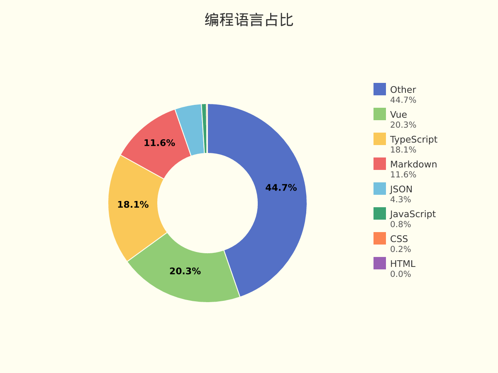
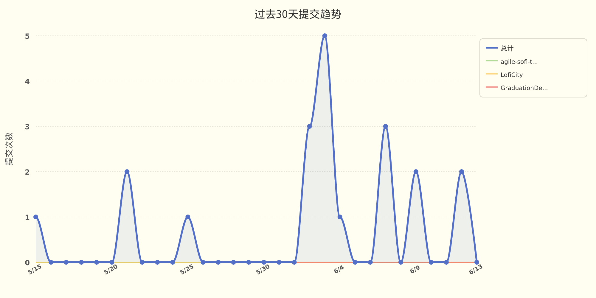

# JaredYe04 的个人主页

欢迎来到我的世界。
这里没有终点，只有不断逼近的答案。

我用代码书写思考，用重构回应混乱，
在技术与创造之间，寻找前进的方向。

这是 JaredYe's World ——
一个持续生长的空间，
也是我与未来对话的方式。

每一次运行，
都是对明天的调用。


###  📊 **过去七天我的编程活动统计**

```
💬 编程语言: 
Other          	3 小时 44 分钟          	██████████████████████░░░░░░░░░░░░░░░░░░░░░░░░░░░░	44.70 %
Vue            	1 小时 41 分钟          	██████████░░░░░░░░░░░░░░░░░░░░░░░░░░░░░░░░░░░░░░░░	20.28 %
TypeScript     	1 小时 30 分钟          	█████████░░░░░░░░░░░░░░░░░░░░░░░░░░░░░░░░░░░░░░░░░	18.06 %
Markdown       	58 分钟               	█████░░░░░░░░░░░░░░░░░░░░░░░░░░░░░░░░░░░░░░░░░░░░░	11.64 %
JSON           	21 分钟               	██░░░░░░░░░░░░░░░░░░░░░░░░░░░░░░░░░░░░░░░░░░░░░░░░	4.34 %
JavaScript     	4 分钟                	░░░░░░░░░░░░░░░░░░░░░░░░░░░░░░░░░░░░░░░░░░░░░░░░░░	0.80 %
CSS            	0 分钟                	░░░░░░░░░░░░░░░░░░░░░░░░░░░░░░░░░░░░░░░░░░░░░░░░░░	0.17 %
HTML           	0 分钟                	░░░░░░░░░░░░░░░░░░░░░░░░░░░░░░░░░░░░░░░░░░░░░░░░░░	0.01 %

⏱️ 使用电脑时间: 
总计 8 小时 21 分钟

📝 代码统计: 
总代码行数 (LOC)      23,388 行
提交次数               7 次
活跃仓库数             2 个
```

###  📊 **编程语言占比**

<picture>
  <source media="(prefers-color-scheme: dark)" srcset="images/language-pie-dark-75c23f8e6c36.png">
  
</picture>

###  📊 **主页浏览量**

  


  📈 **过去30天提交趋势**

<picture>
  <source media="(prefers-color-scheme: dark)" srcset="images/commit-trend-dark-b81c78aa3456.png">
  
</picture>


<picture>
  <source media="(prefers-color-scheme: dark)" srcset="https://raw.githubusercontent.com/JaredYe04/JaredYe04/main/output/github-contribution-grid-snake-dark.svg">
  
</picture>

---

**最后更新**: 2026年06月14日 24:30:13 (UTC+8)

