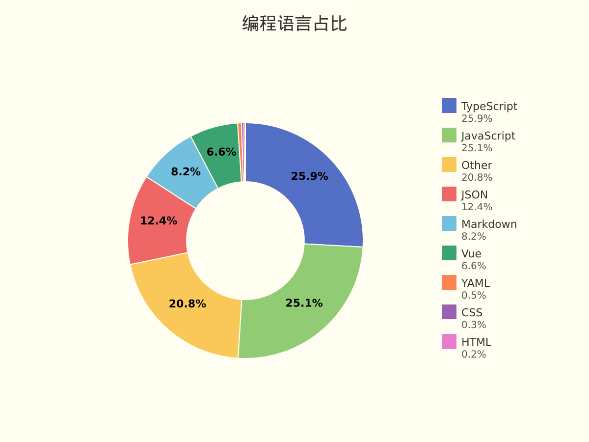
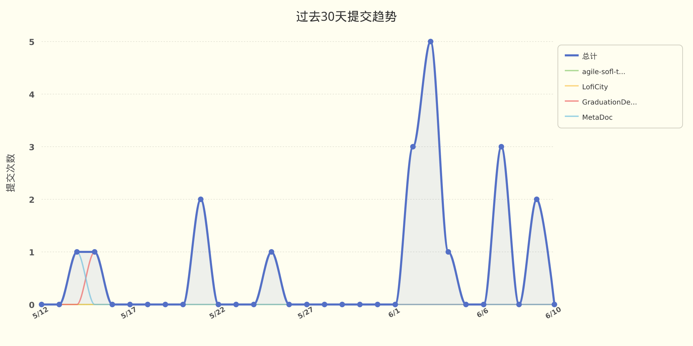

# JaredYe04 的个人主页

欢迎来到我的世界。
这里没有终点，只有不断逼近的答案。

我用代码书写思考，用重构回应混乱，
在技术与创造之间，寻找前进的方向。

这是 JaredYe's World ——
一个持续生长的空间，
也是我与未来对话的方式。

每一次运行，
都是对明天的调用。


###  📊 **过去七天我的编程活动统计**

```
💬 编程语言: 
TypeScript     	4 小时 56 分钟          	████████████░░░░░░░░░░░░░░░░░░░░░░░░░░░░░░░░░░░░░░	25.87 %
JavaScript     	4 小时 48 分钟          	████████████░░░░░░░░░░░░░░░░░░░░░░░░░░░░░░░░░░░░░░	25.13 %
Other          	3 小时 58 分钟          	██████████░░░░░░░░░░░░░░░░░░░░░░░░░░░░░░░░░░░░░░░░	20.76 %
JSON           	2 小时 21 分钟          	██████░░░░░░░░░░░░░░░░░░░░░░░░░░░░░░░░░░░░░░░░░░░░	12.37 %
Markdown       	1 小时 33 分钟          	████░░░░░░░░░░░░░░░░░░░░░░░░░░░░░░░░░░░░░░░░░░░░░░	8.18 %
Vue            	1 小时 16 分钟          	███░░░░░░░░░░░░░░░░░░░░░░░░░░░░░░░░░░░░░░░░░░░░░░░	6.64 %
YAML           	6 分钟                	░░░░░░░░░░░░░░░░░░░░░░░░░░░░░░░░░░░░░░░░░░░░░░░░░░	0.53 %
CSS            	3 分钟                	░░░░░░░░░░░░░░░░░░░░░░░░░░░░░░░░░░░░░░░░░░░░░░░░░░	0.33 %
HTML           	2 分钟                	░░░░░░░░░░░░░░░░░░░░░░░░░░░░░░░░░░░░░░░░░░░░░░░░░░	0.20 %

⏱️ 使用电脑时间: 
总计 19 小时 7 分钟

📝 代码统计: 
总代码行数 (LOC)      47,910 行
提交次数               11 次
活跃仓库数             2 个
```

###  📊 **编程语言占比**

<picture>
  <source media="(prefers-color-scheme: dark)" srcset="images/language-pie-dark-6bf3cbe20eff.png">
  
</picture>

###  📊 **主页浏览量**

  


  📈 **过去30天提交趋势**

<picture>
  <source media="(prefers-color-scheme: dark)" srcset="images/commit-trend-dark-bd12b6562b72.png">
  
</picture>


<picture>
  <source media="(prefers-color-scheme: dark)" srcset="https://raw.githubusercontent.com/JaredYe04/JaredYe04/main/output/github-contribution-grid-snake-dark.svg">
  
</picture>

---

**最后更新**: 2026年06月10日 08:41:55 (UTC+8)

